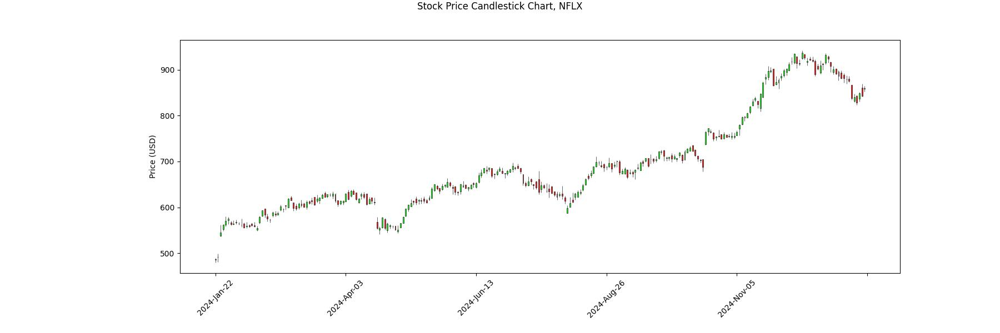

# FinBot
## Example for a Run

**Master Agent:**  
Hi, I am finBot, an AI-driven finance agent. I can help you predict whether a stock is likely to go up or down in the next quarter.  
*Please provide me with the name or the ticker symbol of the stock you would like me to analyze.*

---

**User:**  
`netflix`

---

**Master Agent:**  
Generating Response according to Netflix (NFLX) News:

---

**News Agent:**  
_Request for "News Agent":_  
Based on the following five news documents:

1. **Netflix Stock Could Bounce Off Bullish Trendline**  
   The shares of streaming giant Netflix Inc (NASDAQ:NFLX) pulled back alongside the broader market, logging losses in the past four sessions after hitting a Feb. 14 record high of $1,064.50. However, the security was last seen 2.3% higher to trade at $998.53, approaching a historically bullish trendline that fueled its climb to that peak and could provide additional tailwinds.  
   According to Schaeffer's Senior Quantitative Analyst Rock White, NFLX is nearing its 50-day moving average after spending a significant stretch above it—specifically, 80% of the past two months and eight of the last 10 trading days. In the last three years, the stock triggered this signal nine times, with a one-month gain occurring 67% of the time and averaging a 5.8% return. A similar move would place NFLX back above $1,050.  
   *NFLX Chart: February 26, 2025*  
   Despite the recent dip, the stock remains a strong performer, boasting a 12.2% year-to-date lead and a 66.3% gain over the past 12 months. The equity has climbed higher every month since August and is on track for its seventh consecutive monthly win.  
   Bearish bets have been piling up over the past two weeks, with Netflix stock's 10-day put/call volume ratio of 1 at various exchanges ranking in the 88th percentile of its annual range—indicating an unusually high preference for puts over calls among traders, even as the equity trades near record highs.  
   Meanwhile, options appear to offer an attractive way to speculate on NFLX's next move. The stock's Schaeffer's Volatility Index (SVI) of 31% ranks in the 16th percentile of its annual range, indicating relatively low volatility expectations—a boon for premium buyers.  
   **By:** Jake Scott, *Wed, Feb, Min Read*  
   **Sentiment:** Positive (Confidence: 0.9999722242355347)

2. **Is Netflix Stock A Buy As Video Streamer Considers More NFL Games?**  
   Netflix (NFLX) stock is taking a victory lap after winning the streaming video war. Shares are in record high territory.  
   The streaming giant is reportedly considering adding Sunday afternoon NFL football games to its extensive programming lineup.  
   Netflix hit an all-time high of $1,064.50 on Feb. 14 following its Q4 earnings report, where it beat estimates for subscribers, revenue, and earnings.  
   In an interview with Puck News, Bela Bajaria, Netflix's chief content officer, expressed a strong interest in bidding for Sunday games.  
   Additional analysis details include:  
   - **Fundamental Performance:** Q4 earnings beat expectations; added 18.91 million subscribers.  
   - **Technical Analysis:** Broke out of a flat base at a buy point of 941.75; ended trading at $1,024.54, down 1.8% for the day.  
   - **Market Sentiment:** Despite some bearish bets, the overall sentiment is positive.  
   **By:** Patrick Seitz, *Investor's Business Daily*  
   **Sentiment:** Positive (Confidence: 0.9999994039535522)

3. **If You'd Bought 1 Share of Netflix at Its IPO, Here's How Many Shares You Would Own Now**  
   Netflix (NASDAQ: NFLX) has been a major disruptor in the entertainment industry. Trading at over $1,000 per share, it has been a potential candidate for a stock split.  
   - **Historical Snapshot:**  
     - Founded in 1997 as a DVD-by-mail service, IPO in 2002 at $15 per share.  
     - 2004: 2-for-1 stock split at around $70 per share.  
     - 2007: Pivoted to streaming, soaring to nearly $700 before a 7-for-1 split in 2015.  
   - **Outcome:**  
     - A single IPO share would have become 14 shares.  
     - An initial $15 investment would be worth over $14,000 today.  
   - **Future Speculation:**  
     - Possibility of another stock split as Netflix shares trade above $1,000.  
   **By:** Collin Brantmeyer, *The Motley Fool*  
   **Sentiment:** Neutral (Confidence: 0.9999879598617554)

4. **Is Netflix Stock a Buy Before March 2?**  
   As Netflix evolves into an end-to-end entertainment business, investors are keenly watching its original content and market reinvention.  
   - **Event Spotlight:** March 2, when major entertainment figures gather at the Dolby Theater for the Academy Awards.  
   - **Oscar Nominations:**  
     - Netflix secured 18 Academy Award nominations, the highest among studios for the sixth consecutive year.  
   - **Historical Performance at the Oscars:**  
     - Wins: 23 out of 152 nominations (~15%).  
   - **Post-Oscars Analysis:**  
     - Revenue growth has significantly outpaced expenses since the Oscars recognition.  
   **By:** Adam Spatacco, *The Motley Fool*  
   **Sentiment:** Positive (Confidence: 0.9999914169311523)

5. **Netflix Streaming Peer Soars As Key Metric Clears $1 Billion Milestone**  
   - **Context:** Roku (ROKU) experienced a notable gain after its fourth-quarter results, with its largest revenue segment exceeding $1 billion for the first time.  
   **By:** Vidya Ramakrishnan, *Investor's Business Daily*  
   **Sentiment:** Neutral (Confidence: 0.9846972227096558)

What do you think Netflix (NFLX) stock performance will be in the next quarter? First, state whether the stock is likely to go up or down in the next quarter. Then, provide a brief explanation supporting your prediction.

_"News Agent" Response:_

Based on the aggregated information from the news documents, **Netflix (NFLX) stock is likely to go up in the next quarter**. Here’s why:

1. **Strong Historical Performance and Momentum:**  
   - Consistent growth with a 12.2% year-to-date gain and a 66.3% 12-month increase.  
   - Technical signals (e.g., nearing the 50-day moving average) historically lead to positive gains.

2. **Fundamental Strength:**  
   - Q4 earnings exceeded expectations in revenue, earnings, and subscriber growth.  
   - Robust subscriber growth with 18.91 million new additions in Q4.

3. **Strategic Growth Initiatives:**  
   - Exploring new revenue streams like bidding for NFL games, video podcasts, and live events.  
   - Potential for a stock split, which may make shares more accessible to retail investors.

4. **Low Volatility and Institutional Support:**  
   - Options data suggests low volatility, making the stock attractive for speculation.  
   - Strong institutional buying indicated by a high IBD Accumulation/Distribution Rating (A-).

5. **Oscars and Original Content Impact:**  
   - High number of Academy Award nominations boosts brand reputation and subscriber interest.

While bearish bets have increased recently, the overall sentiment remains positive, supported by strong fundamentals, growth initiatives, and historical performance. Therefore, Netflix stock is likely to perform well in the next quarter.

---

**Master Agent:**  
Generating Response according to Netflix (NFLX) Q10 filing:

---

**Q10 Agent:**  
_Request for Q10 Agent:_  
Based on the following sections from the last Q10 filing:

1. **Item 5. Market for Registrant’s Common Equity, Related Stockholder Matters and Issuer Purchases of Equity Securities**  
   - **Market Information:**  
     - Common stock is traded on the NASDAQ Global Select Market under the symbol “NFLX”.  
   - **Holders:**  
     - As of December 31, 2024, there were approximately 2,752 stockholders of record (with a larger number of beneficial owners).  
   - **Dividend Policy:**  
     - No cash dividends have been declared or paid and none are anticipated in the foreseeable future.  
   - **Company Purchases of Equity Securities:**  
     - Detailed stock repurchase activity during October–December 2024, with total shares purchased of 1,165,827 (in thousands) at varying average prices.  
     - In September 2023, the Board authorized repurchase of up to $10 billion, increased by an additional $15 billion in December 2024.  
   - **Stock Performance Graph:**  
     - A five-year cumulative stockholder return comparison to the NASDAQ Composite, S&P 500, and RDG Internet Composite Index is provided.

2. **Item 9. Changes in and Disagreements with Accountants on Accounting and Financial Disclosure**  
   - **Disclosures:**  
     - No changes or disagreements with accountants were noted.  
   - **Controls and Procedures:**  
     - Management’s evaluation concluded that disclosure controls and internal controls over financial reporting were effective as of December 31, 2024.  
     - Internal control over financial reporting was audited by Ernst & Young LLP, with an unqualified opinion.

3. **Expenses, Liquidity, and Capital Resources**  
   - **Expenses:**  
     - General and administrative expenses decreased slightly (by 1%) and remained stable as a percentage of revenues (4–5%).  
     - Interest expense increased modestly by 3% due to higher debt levels.  
     - Interest and other income improved significantly due to better foreign exchange outcomes.  
   - **Liquidity:**  
     - Cash, cash equivalents, restricted cash, and short-term investments increased by 34% to $9.6 billion.  
     - Debt increased by 7%, with a healthy revolving credit facility of $3 billion available.
   - **Additional Considerations:**  
     - The company effectively manages its debt maturities and is well-positioned for potential strategic investments or further share repurchases.

What do you think Netflix (NFLX) stock performance will be in the next quarter? First, state whether the stock is likely to go up or down in the next quarter. Then, provide a brief explanation supporting your prediction.

_Q10 Agent Response:_

Based on the information provided, **Netflix (NFLX) stock is likely to go up in the next quarter**. Here’s the reasoning:

1. **Strong Share Repurchase Program:**  
   - Aggressive buybacks (with $6.2B spent in 2024 and an additional $15B authorized) reduce the number of outstanding shares, potentially increasing earnings per share (EPS) and signaling management confidence.

2. **Improved Liquidity Position:**  
   - A 34% increase in cash, cash equivalents, and short-term investments to $9.6B provides a solid liquidity buffer, enabling further investments or share repurchases.

3. **Effective Cost Management:**  
   - General and administrative expenses remained stable, and the consistent effective tax rate (13%) demonstrates disciplined cost control, supporting profitability.

4. **Favorable Foreign Exchange Impacts:**  
   - Significant improvement in foreign exchange outcomes positively contributed to the "Interest and Other Income (Expense)" line, bolstering net income.

5. **Prudent Debt Management:**  
   - Although debt increased moderately, Netflix’s ability to manage debt maturities and access capital markets through a revolving credit facility provides financial flexibility.

6. **Market Confidence:**  
   - Historical performance and robust financial metrics, as reflected in the stock performance graph, support a positive outlook and investor confidence.

**Risks to Consider:**  
- **Macroeconomic Conditions:** Uncertainty or rising interest rates could dampen consumer spending and affect stock performance.  
- **Content Costs:** High production and content acquisition costs may pressure margins.  
- **Intense Competition:** The competitive streaming landscape remains a potential headwind.

Overall, Netflix’s strong financial position, proactive share repurchase strategy, and effective cost and debt management suggest that the stock is well-positioned for upward performance in the next quarter.

---
**Master Agent:**  
Generating Response according to Netflix (NFLX) Reported Financial Numbers:
---

**Reported Financial Numbers Agent:**

_Request for Reported Financial Numbers Agent:_  

The following table contains numerical statistics on the last five quarterly earnings reports of Netflix (NFLX). It includes the earnings per share (EPS) estimate, the reported EPS, and the earnings surprise percentage for each quarter.

| Date       | EPS Estimate | Reported EPS | Surprise (%) |
|------------|--------------|--------------|--------------|
| 2025-01-20 | 4.20         | 4.27         | 1.74         |
| 2024-10-16 | 5.12         | 5.40         | 5.55         |
| 2024-07-17 | 4.74         | 4.88         | 2.89         |
| 2024-04-17 | 4.52         | 5.28         | 16.75        |
| 2024-01-22 | 2.22         | 2.11         | -4.83        |

Additionally, here is a table which compares the financial performance of the company according to the last five earning reports (including the last):

**Company Earnings Data:**

|                     |   Tax Effect Of Unusual Items |   Tax Rate For Calcs |   Normalized EBITDA |   Net Income From Continuing Operation Net Minority Interest |   Reconciled Depreciation |   Reconciled Cost Of Revenue |      EBITDA |        EBIT |   Net Interest Income |   Interest Expense | Interest Income   |   Normalized Income |   Net Income From Continuing And Discontinued Operation |   Total Expenses |   Total Operating Income As Reported | Diluted Average Shares   | Basic Average Shares   | Diluted EPS   | Basic EPS   |   Diluted NI Availto Com Stockholders |   Net Income Common Stockholders |   Net Income |   Net Income Including Noncontrolling Interests |   Net Income Continuous Operations |   Tax Provision |   Pretax Income |   Net Non Operating Interest Income Expense |   Interest Expense Non Operating | Interest Income Non Operating   |   Operating Income |   Operating Expense |   Research And Development |   Selling General And Administration |   Selling And Marketing Expense |   General And Administrative Expense |   Other Gand A |   Gross Profit |   Cost Of Revenue |   Total Revenue |   Operating Revenue |
|:--------------------|------------------------------:|---------------------:|--------------------:|-------------------------------------------------------------:|--------------------------:|-----------------------------:|------------:|------------:|----------------------:|-------------------:|:------------------|--------------------:|--------------------------------------------------------:|-----------------:|-------------------------------------:|:-------------------------|:-----------------------|:--------------|:------------|--------------------------------------:|---------------------------------:|-------------:|------------------------------------------------:|-----------------------------------:|----------------:|----------------:|--------------------------------------------:|---------------------------------:|:--------------------------------|-------------------:|--------------------:|---------------------------:|-------------------------------------:|--------------------------------:|-------------------------------------:|---------------:|---------------:|------------------:|----------------:|--------------------:|
| 2024-12-31 00:00:00 |                             0 |             0.124474 |         6.56791e+09 |                                                  1.86861e+09 |               4.24104e+09 |                  5.76736e+09 | 6.56791e+09 | 2.32687e+09 |          -1.38498e+08 |        1.92603e+08 | 54105000.0        |         1.86861e+09 |                                             1.86861e+09 |      7.97375e+09 |                          2.27277e+09 | N/A                      | N/A                    | N/A           | N/A         |                           1.86861e+09 |                      1.86861e+09 |  1.86861e+09 |                                     1.86861e+09 |                        1.86861e+09 |     2.65661e+08 |     2.13427e+09 |                                -1.38498e+08 |                      1.92603e+08 | 54105000.0                      |        2.27277e+09 |         2.20638e+09 |                7.76505e+08 |                          1.42988e+09 |                     9.76204e+08 |                          4.53674e+08 |    4.53674e+08 |    4.47915e+09 |       5.76736e+09 |     1.02465e+10 |         1.02465e+10 |
| 2024-09-30 00:00:00 |                             0 |             0.13     |         6.68991e+09 |                                                  2.36351e+09 |               3.78044e+09 |                  5.11988e+09 | 6.68991e+09 | 2.90948e+09 |          -2.06523e+08 |        2.06523e+08 | N/A               |         2.36351e+09 |                                             2.36351e+09 |      6.91523e+09 |                          2.90948e+09 | 437898000.0              | 428239000.0            | 5.4           | 5.52        |                           2.36351e+09 |                      2.36351e+09 |  2.36351e+09 |                                     2.36351e+09 |                        2.36351e+09 |     3.39445e+08 |     2.70295e+09 |                                -2.06523e+08 |                      2.06523e+08 | N/A                             |        2.90948e+09 |         1.79534e+09 |                7.35063e+08 |                          1.06028e+09 |                     6.42926e+08 |                          4.17353e+08 |    4.17353e+08 |    4.70482e+09 |       5.11988e+09 |     9.8247e+09  |         9.8247e+09  |
| 2024-06-30 00:00:00 |                             0 |             0.15     |         6.53276e+09 |                                                  2.14731e+09 |               3.85092e+09 |                  5.17414e+09 | 6.53276e+09 | 2.68184e+09 |          -8.8981e+07  |        1.67986e+08 | 79005000.0        |         2.14731e+09 |                                             2.14731e+09 |      6.95647e+09 |                          2.60284e+09 | 439739000.0              | 430065000.0            | 4.88          | 4.99        |                           2.14731e+09 |                      2.14731e+09 |  2.14731e+09 |                                     2.14731e+09 |                        2.14731e+09 |     3.6655e+08  |     2.51386e+09 |                                -8.8981e+07  |                      1.67986e+08 | 79005000.0                      |        2.60284e+09 |         1.78233e+09 |                7.11254e+08 |                          1.07108e+09 |                     6.44084e+08 |                          4.26992e+08 |    4.26992e+08 |    4.38517e+09 |       5.17414e+09 |     9.55931e+09 |         9.55931e+09 |
| 2024-03-31 00:00:00 |                             0 |             0.11     |         6.54593e+09 |                                                  2.33221e+09 |               3.75804e+09 |                  4.97707e+09 | 6.54593e+09 | 2.78789e+09 |          -1.7955e+07  |        1.73314e+08 | 155359000.0       |         2.33221e+09 |                                             2.33221e+09 |      6.73791e+09 |                          2.63253e+09 | 441654000.0              | 432090000.0            | 5.28          | 5.4         |                           2.33221e+09 |                      2.33221e+09 |  2.33221e+09 |                                     2.33221e+09 |                        2.33221e+09 |     2.8237e+08  |     2.61458e+09 |                                -1.7955e+07  |                      1.73314e+08 | 155359000.0                     |        2.63253e+09 |         1.76083e+09 |                7.02473e+08 |                          1.05836e+09 |                     6.5434e+08  |                          4.0402e+08  |    4.0402e+08  |    4.39337e+09 |       4.97707e+09 |     9.37044e+09 |         9.37044e+09 |
| 2023-12-31 00:00:00 |                             0 |             0.183175 |         5.21278e+09 |                                                  9.37838e+08 |               3.84065e+09 |                  5.30748e+09 | 5.21278e+09 | 1.37213e+09 |          -3.47959e+08 |        2.23984e+08 | N/A               |         9.37838e+08 |                                             9.37838e+08 |      7.33672e+09 |                          1.49611e+09 | 444292000.0              | 435923000.0            | 2.11          | 2.15        |                           9.37838e+08 |                      9.37838e+08 |  9.37838e+08 |                                     9.37838e+08 |                        9.37838e+08 |     2.10312e+08 |     1.14815e+09 |                                -3.47959e+08 |                      2.23984e+08 | N/A                             |        1.49611e+09 |         2.02923e+09 |                6.73341e+08 |                          1.35589e+09 |                     9.16617e+08 |                          4.39273e+08 |    4.39273e+08 |    3.52534e+09 |       5.30748e+09 |     8.83282e+09 |         8.83282e+09 |

Based on this financial data, what do you think Netflix (NFLX) stock performance will be in the next quarter? First, state whether the stock is likely to go up or down in the next quarter. Then, provide a brief explanation supporting your prediction.

_Reported Financial Numbers Agent Response:_

Based on the provided data, **Netflix (NFLX) stock is likely to go up in the next quarter**. Here's the reasoning:

1. **Consistent Earnings Surprises**: Over the last five quarters, Netflix has consistently beaten its EPS estimates in four out of five quarters, with positive earnings surprises ranging from 1.74% to 16.75%. This indicates strong operational performance and the ability to exceed market expectations, which typically boosts investor confidence and stock prices.

2. **Improving Financial Metrics**: Key financial metrics such as normalized EBITDA, net income, and operating income have shown consistent growth over the last few quarters. For example, normalized EBITDA increased from $5.21 billion in Q4 2023 to $6.57 billion in Q4 2024, reflecting improved profitability and operational efficiency.

3. **Revenue Growth**: Total revenue has been steadily increasing, reaching $10.25 billion in Q4 2024, up from $8.83 billion in Q4 2023. This growth suggests that Netflix is successfully expanding its subscriber base or increasing its average revenue per user (ARPU), which is a positive signal for future performance.

4. **Market Sentiment and Momentum**: The stock market often rewards companies that consistently outperform expectations. Netflix's ability to deliver strong results in recent quarters, coupled with its robust financial performance, is likely to sustain positive momentum in its stock price.

5. **One Negative Quarter Offset by Strong Recovery**: While Netflix reported a negative earnings surprise in Q4 2023 (-4.83%), it quickly rebounded with strong positive surprises in subsequent quarters. This demonstrates resilience and the ability to recover from short-term setbacks.

### Caveat:
While the data suggests a positive outlook, external factors such as macroeconomic conditions, competition, or changes in consumer behavior could impact Netflix's performance. Investors should also monitor guidance for the next quarter and any updates on subscriber growth or content strategy.

In summary, based on historical performance and financial trends, Netflix's stock is likely to perform well in the next quarter, with an upward trajectory expected.

---

**Master Agent:**  
Generating Response according to Netflix (NFLX) Stock Price Chart:

---

**Stock Price Agent:**

_Stock Price Agent Request:_

Based on the following candlestick chart of the stock's prices, what do you think Netflix (NFLX) stock performance will be in the next quarter? First, state whether the stock is likely to go up or down in the next quarter. Then, provide a brief explanation supporting your prediction.

**Image:**  

_Stock Price Agent Response:_ 

Based on the candlestick chart provided, **Netflix (NFLX) stock is likely to go up in the next quarter**.

**Explanation:**
1. **Uptrend Continuation:**  
   - The chart shows a clear long-term uptrend, characterized by higher highs and higher lows over the observed period.  
   - Despite some pullbacks, the stock has consistently recovered and moved higher, indicating strong bullish momentum.

2. **Recent Recovery:**  
   - After a recent dip, the stock appears to have found support and is beginning to recover, as seen in the most recent candlesticks.  
   - This recovery suggests renewed buying interest among investors.

3. **Market Sentiment:**  
   - The overall pattern reflects a healthy trend, where minor corrections are quickly followed by rebounds—a common sign of a robust uptrend.

_Note:_ 
This prediction is based solely on technical analysis of the chart. Fundamental factors—such as earnings reports, subscriber growth, and broader macroeconomic conditions—could significantly impact the stock's future performance.

---

**Master Agent (Final Statement):**  
Based on the information provided, the stock of Netflix (NFLX) is likely to go up in the next quarter.
