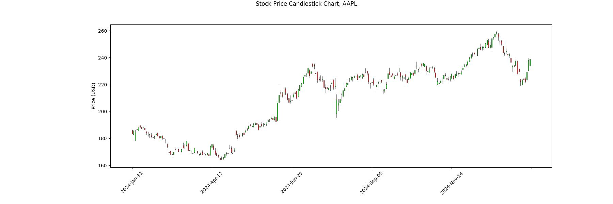

## 2nd example for a run

**Master Agent:**

Hi, I am finBot, an AI-driven finance agent. I can help you predict whether a stock is likely to go up or down in the next quarter.
*Please provide me with the name or the ticker symbol of the stock you would like me to analyze.*

---

**User:**

`apple`

---

**Master Agent:**

Generating Response according to Apple (APPL) News:

---

**News Agent:** 

Request for "News Agent":

Based on the following three news documents:

**1.** Warren Buffett Is Still Holding His Apple Stock: Should You?
Warren Buffett has stopped trimming his Apple (NASDAQ: AAPL) position. The billionaire from Omaha kept his largest position for Berkshire Hathaway unchanged in the fourth quarter after dumping most of his ownership in the first three quarters of 2024. Apple remains Berkshire Hathaway's largest equity investment, worth $75 billion as of this writing.
Buffett is giving the signal to the market that he intends to keep his ownership position in Apple, just at a reduced size, indicating that he is bullish on the stock's future. Does that mean you should keep holding on to your Apple shares? Or is now a good time to dump the megacap stock and buy something else?
Let's take a closer look at this technology giant and find out.
Return to revenue growth
Apple is one of the largest businesses in the world, generating $396 billion in revenue over the last 12 months. However, in the years after the 2021 boom in technology hardware spending, the iPhone maker saw stagnating and even declining revenue.
That has changed in the last few quarters. Revenue grew 4% year over year last quarter to $124.3 billion, with operating margin hitting a record 32% over the last 12 months. The company is seeing strong growth from its software services division, which has high margins and will help it gain operating leverage. Services revenue was over $26 billion last quarter compared to $23 billion in the year prior.
With a consistent share repurchase program, Apple has been able to return a ton of capital to shareholders in the last few years, which has helped it propel dividend payments much higher. Dividend per share is up 110% in the last 10 years, although the current dividend yield sits at just 0.42%. Apple's hardware business remains steady, although it is not growing much anymore, while revenue from its software services continues to grow at a quick pace.
Low-cost model, headwinds in China, antitrust lawsuits
In order to catalyze growth for its hardware division, Apple is releasing a lower-priced iPhone 16E. The product costs $600 versus $800 or much higher for the latest iPhones, which could help attract more people to switch or upgrade to Apple products. It is not getting much growth from new hardware, such as the Watch, airpods, or Vision Pro. The Vision Pro -- a virtual reality headset released just last year -- has been discontinued after it failed to sell very many units.
Apple is searching for ways to keep the growth party going. Even though revenue grew last quarter, the company is facing revenue headwinds in large geographies such as China, where revenue has fallen for many quarters in a row. The company is losing market share to homegrown Chinese brands.

**By:** Brett Schafer, The Motley Fool, Mon, Mar, Min Read

**Sentiment**: Neutral (Confidence of 0.9997082352638245)

**2.** How much does Apple's staggered AI rollout really matter to the stock?
Another feature of Apple's AI rollout might be delayed, but investors shouldn't be concerned. While the tech behemoth may lag in timing, it's always led in quality. The news Shares of the iPhone maker dropped 2% in Monday's terrible market, a day after Bloomberg reported that Apple's conversational version of Siri may not reach customers before its mobile operating system iOS 20 comes out in 2027. Apple is currently operating on iOS 18. The article put it in stark terms: "That would mean Apple is a half-decade late to the game — an even bleaker timeline than many of us imagined." The company has also struggled to develop its other generative artificial intelligence capabilities on time while other Big Tech peers have continued to move forward with their own use cases. Back in December , Apple released its long-awaited ChatGPT-powered Siri and said additional improvements to Siri, such as allowing the virtual assistant to take actions inside of apps, were expected in 2025. Bloomberg on Sunday said Apple is still expected to deliver those improvements in May, but they might be less advanced than some users had hoped. Apple did not immediately respond Monday to CNBC's request for comment. Big picture The slower rollout of Apple AI, which it calls Apple Intelligence, should not necessarily come as a surprise. Remember, the tech giant originally showcased its AI ambitions in June 2024. When the new iPhone 16 models were launched in September, those AI features were not available yet. The first Apple Intelligence features were released in October and have continued on a staggered rollout. AAPL YTD mountain Apple YTD The Bloomberg report of Siri delays and complications surfaced less than a week after Amazon announced a conversational version of its Alexa digital assistant, called Alexa+. Amazon will charge a monthly fee for Alexa+ as a standalone. It will be included at no extra cost for Prime members. Last Thursday, a day after the Alexa+ announcement, Meta Platforms said it plans to debut a standalone AI app in the months to come. Bottom line Apple's AI strategy should not be a major concern for Wall Street or its stock. The company has never been first to market. But once officially released, Apple's offerings have always been some of the most innovative and beloved among users. For example, Apple didn't invent the digital music players, the smartphone, or wireless earbuds. Still, the iPod, the iPhone, and AirPods have had enormous commercial success. "Historically, Apple has been slower in bringing new technology to market because it prioritizes getting it right the first time," said Jeff Marks, the CNBC Investing Club's director of portfolio analysis. "They only release products or features when they're confident they will be well received." Marks added that Apple could always partner to speed up the release of updated Siri features, if necessary. One thing to consider, however, is Amazon's Alexa revamp could serve as a test for how consumers embrace these AI-enabled digital assistants. More broadly, Alibaba Chairman Joe Tsai confirmed last month that Apple will be integrating the Chinese tech giant's AI into iPhones in China. Getting users in China to upgrade their devices to run AI would be a big boost for Apple, which has seen its U.S. refresh pick up slower than expected due to those AI feature delays. China is the world's second-largest economy and Apple's second-largest market. To be sure, Apple has more going for it than just its AI potential. The company continues to grab smartphone share in emerging markets, like India, and rake in solid revenue streams through its services business. We maintain our "own it, don't trade it" thesis on the stock. (Jim Cramer's Charitable Trust is long AAPL, AMZN, META. See here for a full list of the stocks.) As a subscriber to the CNBC Investing Club with Jim Cramer, you will receive a trade alert before Jim makes a trade. Jim waits 45 minutes after sending a trade alert before buying or selling a stock in his charitable trust's portfolio. If Jim has talked about a stock on CNBC TV, he waits 72 hours after issuing the trade alert before executing the trade. THE ABOVE INVESTING CLUB INFORMATION IS SUBJECT TO OUR TERMS AND CONDITIONS AND PRIVACY POLICY , TOGETHER WITH OUR DISCLAIMER . NO FIDUCIARY OBLIGATION OR DUTY EXISTS, OR IS CREATED, BY VIRTUE OF YOUR RECEIPT OF ANY INFORMATION PROVIDED IN CONNECTION WITH THE INVESTING CLUB. NO SPECIFIC OUTCOME OR PROFIT IS GUARANTEED.
The Apple Fifth Avenue store in New York, US, on Monday, Feb. 24, 2025. Michael Nagle | Bloomberg | Getty Images

**By:**  Morgan Chittum

**Sentiment:**  Neutral (Confidence of 0.9546042680740356)

**3.** How much does Apple's staggered AI rollout really matter to the stock?
Another feature of Apple's AI rollout might be delayed, but investors shouldn't be concerned. While the tech behemoth may lag in timing, it's always led in quality. The news Shares of the iPhone maker dropped 2% in Monday's terrible market, a day after Bloomberg reported that Apple's conversational version of Siri may not reach customers before its mobile operating system iOS 20 comes out in 2027. Apple is currently operating on iOS 18. The article put it in stark terms: "That would mean Apple is a half-decade late to the game — an even bleaker timeline than many of us imagined." The company has also struggled to develop its other generative artificial intelligence capabilities on time while other Big Tech peers have continued to move forward with their own use cases. Back in December , Apple released its long-awaited ChatGPT-powered Siri and said additional improvements to Siri, such as allowing the virtual assistant to take actions inside of apps, were expected in 2025. Bloomberg on Sunday said Apple is still expected to deliver those improvements in May, but they might be less advanced than some users had hoped. Apple did not immediately respond Monday to CNBC's request for comment. Big picture The slower rollout of Apple AI, which it calls Apple Intelligence, should not necessarily come as a surprise. Remember, the tech giant originally showcased its AI ambitions in June 2024. When the new iPhone 16 models were launched in September, those AI features were not available yet. The first Apple Intelligence features were released in October and have continued on a staggered rollout. AAPL YTD mountain Apple YTD The Bloomberg report of Siri delays and complications surfaced less than a week after Amazon announced a conversational version of its Alexa digital assistant, called Alexa+. Amazon will charge a monthly fee for Alexa+ as a standalone. It will be included at no extra cost for Prime members. Last Thursday, a day after the Alexa+ announcement, Meta Platforms said it plans to debut a standalone AI app in the months to come. Bottom line Apple's AI strategy should not be a major concern for Wall Street or its stock. The company has never been first to market. But once officially released, Apple's offerings have always been some of the most innovative and beloved among users. For example, Apple didn't invent the digital music players, the smartphone, or wireless earbuds. Still, the iPod, the iPhone, and AirPods have had enormous commercial success. "Historically, Apple has been slower in bringing new technology to market because it prioritizes getting it right the first time," said Jeff Marks, the CNBC Investing Club's director of portfolio analysis. "They only release products or features when they're confident they will be well received." Marks added that Apple could always partner to speed up the release of updated Siri features, if necessary. One thing to consider, however, is Amazon's Alexa revamp could serve as a test for how consumers embrace these AI-enabled digital assistants. More broadly, Alibaba Chairman Joe Tsai confirmed last month that Apple will be integrating the Chinese tech giant's AI into iPhones in China. Getting users in China to upgrade their devices to run AI would be a big boost for Apple, which has seen its U.S. refresh pick up slower than expected due to those AI feature delays. China is the world's second-largest economy and Apple's second-largest market. To be sure, Apple has more going for it than just its AI potential. The company continues to grab smartphone share in emerging markets, like India, and rake in solid revenue streams through its services business. We maintain our "own it, don't trade it" thesis on the stock. (Jim Cramer's Charitable Trust is long AAPL, AMZN, META. See here for a full list of the stocks.) As a subscriber to the CNBC Investing Club with Jim Cramer, you will receive a trade alert before Jim makes a trade. Jim waits 45 minutes after sending a trade alert before buying or selling a stock in his charitable trust's portfolio. If Jim has talked about a stock on CNBC TV, he waits 72 hours after issuing the trade alert before executing the trade. THE ABOVE INVESTING CLUB INFORMATION IS SUBJECT TO OUR TERMS AND CONDITIONS AND PRIVACY POLICY , TOGETHER WITH OUR DISCLAIMER . NO FIDUCIARY OBLIGATION OR DUTY EXISTS, OR IS CREATED, BY VIRTUE OF YOUR RECEIPT OF ANY INFORMATION PROVIDED IN CONNECTION WITH THE INVESTING CLUB. NO SPECIFIC OUTCOME OR PROFIT IS GUARANTEED.
The Apple Fifth Avenue store in New York, US, on Monday, Feb. 24, 2025. Michael Nagle | Bloomberg | Getty Images

**By:** Morgan Chittum
**Sentiment**: Neutral (Confidence of 0.9546042680740356)

**4.** How much does Apple's staggered AI rollout really matter to the stock?
Another feature of Apple's AI rollout might be delayed, but investors shouldn't be concerned. While the tech behemoth may lag in timing, it's always led in quality. The news Shares of the iPhone maker dropped 2% in Monday's terrible market, a day after Bloomberg reported that Apple's conversational version of Siri may not reach customers before its mobile operating system iOS 20 comes out in 2027. Apple is currently operating on iOS 18. The article put it in stark terms: "That would mean Apple is a half-decade late to the game — an even bleaker timeline than many of us imagined." The company has also struggled to develop its other generative artificial intelligence capabilities on time while other Big Tech peers have continued to move forward with their own use cases. Back in December , Apple released its long-awaited ChatGPT-powered Siri and said additional improvements to Siri, such as allowing the virtual assistant to take actions inside of apps, were expected in 2025. Bloomberg on Sunday said Apple is still expected to deliver those improvements in May, but they might be less advanced than some users had hoped. Apple did not immediately respond Monday to CNBC's request for comment. Big picture The slower rollout of Apple AI, which it calls Apple Intelligence, should not necessarily come as a surprise. Remember, the tech giant originally showcased its AI ambitions in June 2024. When the new iPhone 16 models were launched in September, those AI features were not available yet. The first Apple Intelligence features were released in October and have continued on a staggered rollout. AAPL YTD mountain Apple YTD The Bloomberg report of Siri delays and complications surfaced less than a week after Amazon announced a conversational version of its Alexa digital assistant, called Alexa+. Amazon will charge a monthly fee for Alexa+ as a standalone. It will be included at no extra cost for Prime members. Last Thursday, a day after the Alexa+ announcement, Meta Platforms said it plans to debut a standalone AI app in the months to come. Bottom line Apple's AI strategy should not be a major concern for Wall Street or its stock. The company has never been first to market. But once officially released, Apple's offerings have always been some of the most innovative and beloved among users. For example, Apple didn't invent the digital music players, the smartphone, or wireless earbuds. Still, the iPod, the iPhone, and AirPods have had enormous commercial success. "Historically, Apple has been slower in bringing new technology to market because it prioritizes getting it right the first time," said Jeff Marks, the CNBC Investing Club's director of portfolio analysis. "They only release products or features when they're confident they will be well received." Marks added that Apple could always partner to speed up the release of updated Siri features, if necessary. One thing to consider, however, is Amazon's Alexa revamp could serve as a test for how consumers embrace these AI-enabled digital assistants. More broadly, Alibaba Chairman Joe Tsai confirmed last month that Apple will be integrating the Chinese tech giant's AI into iPhones in China. Getting users in China to upgrade their devices to run AI would be a big boost for Apple, which has seen its U.S. refresh pick up slower than expected due to those AI feature delays. China is the world's second-largest economy and Apple's second-largest market. To be sure, Apple has more going for it than just its AI potential. The company continues to grab smartphone share in emerging markets, like India, and rake in solid revenue streams through its services business. We maintain our "own it, don't trade it" thesis on the stock. (Jim Cramer's Charitable Trust is long AAPL, AMZN, META. See here for a full list of the stocks.) As a subscriber to the CNBC Investing Club with Jim Cramer, you will receive a trade alert before Jim makes a trade. Jim waits 45 minutes after sending a trade alert before buying or selling a stock in his charitable trust's portfolio. If Jim has talked about a stock on CNBC TV, he waits 72 hours after issuing the trade alert before executing the trade. THE ABOVE INVESTING CLUB INFORMATION IS SUBJECT TO OUR TERMS AND CONDITIONS AND PRIVACY POLICY , TOGETHER WITH OUR DISCLAIMER . NO FIDUCIARY OBLIGATION OR DUTY EXISTS, OR IS CREATED, BY VIRTUE OF YOUR RECEIPT OF ANY INFORMATION PROVIDED IN CONNECTION WITH THE INVESTING CLUB. NO SPECIFIC OUTCOME OR PROFIT IS GUARANTEED.
The Apple Fifth Avenue store in New York, US, on Monday, Feb. 24, 2025. Michael Nagle | Bloomberg | Getty Images

**By:**  Morgan Chittum

**Sentiment:** Neutral (Confidence of 0.9546042680740356)

**5.** Which Will Win the Race to $5 Trillion: Apple or Nvidia Stock?
Although the world has never seen a $5 trillion company, there is a competitive race between Apple (NASDAQ: AAPL) and Nvidia (NASDAQ: NVDA). Apple has a large lead with its $3.6 trillion market cap, but Nvidia isn't far behind with a $3 trillion market cap. While those figures may sound close, the gap between the two is equivalent to around the entire valuation of Netflix, Home Depot, or Johnson & Johnson.
Is Apple's leadership position too far ahead for Nvidia to close the gap? Or is Nvidia primed to beat Apple to this milestone?
Apple's growth has been stagnant over the past three years
Because of their sheer size, everyone is fairly familiar with Apple's and Nvidia's businesses. Apple is the premier consumer tech brand, with its product ecosystem headed up by the iPhone. Nvidia manufactures graphics processing units (GPUs), which are in huge demand thanks to the artificial intelligence (AI) arms race.
Both of these products have a large use case, but only one company is growing at an appreciable rate: Nvidia. Apple has been stuck in a growth rut for three years, with its earnings per share and revenue hardly rising since the start of 2022.
AAPL Revenue (TTM) data by YCharts. EPS = earnings per share. TTM = trailing 12 months.
While this trend is starting to move up, it's hardly appreciable. Analysts expect a mere 4.6% revenue growth for fiscal year 2025, so Apple is clearly a sluggish grower. However, despite its revenue and earnings growing in the mid-4% range over the past three years, Apple's stock is up 36%.
How? Investors are willing to pay more than ever before for the stock.
Apple's stock now has an incredibly expensive valuation of 38 times trailing earnings and 33 times forward earnings despite having very little growth to show for it. This is in stark contrast to Nvidia, which is growing rapidly.
Nvidia's growth will propel it to a $5 trillion valuation quickly
Nvidia's primary chance of catching Apple and beating it to the $5 trillion mark is due to its rapid growth. Despite many investors worrying that Nvidia's growth would slow down, it recently reported that its fourth-quarter FY 2025 (ended January 26) revenue rose 78% year over year, with earnings per share (EPS) increasing 82%. Furthermore, management expects Q1 revenue to be around $43 billion, indicating around 65% growth.
Nvidia's management is known for issuing conservative guidance for the next quarter and actually projected 70% revenue growth in Q4 versus the 78% actual. So, this Q1 projection indicates nearly the same growth projection Q4 had, meaning Nvidia's growth is barely slowing.

**By:** Keithen Drury, The Motley Fool, Tue, Mar, Min Read

**Sentiment:** Positive (Confidence of 0.9920129179954529)

*What do you think Apple (AAPL) stock performance will be in the next quarter? First, state whether the stock is likely to go up or down in the next quarter. Then, provide a brief explanation supporting your prediction.*

_"News Agent" Response:_
Based on the aggregated information from the news documents, **Apple (AAPL) stock is likely to go up in the next quarter**. Here’s why:

1. **Revenue Growth and Operating Margins:** Apple has returned to revenue growth, with a 4% year-over-year increase in the last quarter and record operating margins of 32%. Its high-margin services division continues to grow rapidly, contributing to overall profitability and shareholder returns.

2. **Shareholder-Friendly Policies:** Apple's consistent share repurchase program and dividend growth (up 110% over the last decade) make it attractive to long-term investors. These actions signal confidence in the company's financial health and ability to generate cash flow.

3. **Emerging Market Expansion:** Apple is gaining smartphone market share in emerging markets like India, which could offset challenges in mature markets like China. This geographic diversification supports future growth.

4. **AI and Innovation Potential:** While Apple's AI rollout has been slower than competitors, the company has a history of prioritizing quality over speed. Once its AI features are fully integrated, they could enhance the user experience and drive device upgrades, particularly in key markets like China.

5. **Valuation and Investor Sentiment:** Despite its high valuation, Apple remains a market leader with strong brand loyalty and a robust ecosystem. Investors continue to view it as a safe, long-term investment, especially in uncertain market conditions.

While there are headwinds, such as competition in China and delays in AI development, Apple's strong fundamentals, shareholder returns, and growth in services and emerging markets are likely to outweigh these concerns, driving the stock higher in the next quarter.

---

**Master Agent:**  
Generating Response according to Apple (AAPL) Q10 filing:

---

**Q10 Agent:**  
_Request for Q10 Agent:_  
Based on the following sections from the last Q10 filing:

1. Item 1. Legal Proceedings
Digital Markets Act Investigations
On March 25, 2024, the Commission announced that it had opened two formal noncompliance investigations against the Company under the European Union
(“EU”) Digital Markets Act (the “DMA”). The Commission’s investigations concern (1) Article 5(4) of the DMA, which relates to how developers may communicate
and promote offers to end users for apps distributed through the App Store as well as how developers may conclude contracts with those end users; and (2)
Article 6(3) of the DMA, which relates to default settings, uninstallation of apps, and a web browser choice screen on iOS. On June 24, 2024, the Commission
announced its preliminary findings in the Article 5(4) investigation alleging that the Company’s App Store rules are in breach of the DMA and announced that it
had opened a third formal investigation against the Company regarding whether the Company’s new contractual requirements for third-party app developers and
app marketplaces may violate the DMA. If the Commission makes a final determination that there has been a violation, it can issue a cease and desist order and
may impose fines up to 10% of the Company’s annual worldwide net sales. Although any decision by the Commission can be appealed to the General Court of
the EU, the effectiveness of the Commission’s order would apply immediately while the appeal is pending, unless a stay of the order is granted. The Company
believes that it complies with the DMA and has continued to make changes to its compliance plan in response to feedback and engagement with the
Commission.
Department of Justice Lawsuit
On March 21, 2024, the U.S. Department of Justice (the “DOJ”) and a number of state and district attorneys general filed a civil antitrust lawsuit in the U.S.
District Court for the District of New Jersey against the Company alleging monopolization or attempted monopolization in the markets for “performance
smartphones” and “smartphones” in violation of U.S. antitrust laws. The DOJ is seeking equitable relief to redress the alleged anticompetitive behavior. In
addition, various civil litigation matters have been filed in state and federal courts in the U.S. alleging similar violations of U.S. antitrust laws and seeking
monetary damages and other nonmonetary relief. The Company believes it has substantial defenses and intends to vigorously defend itself.
Epic Games
Epic Games, Inc. (“Epic”) filed a lawsuit in the U.S. District Court for the Northern District of California (the “California District Court”) against the Company
alleging violations of federal and state antitrust laws and California’s unfair competition law based upon the Company’s operation of its App Store. The California
District Court found that certain provisions of the Company’s App Store Review Guidelines violate California’s unfair competition law and issued an injunction
enjoining the Company from prohibiting developers from including in their apps external links that direct customers to purchasing mechanisms other than Apple
in-app purchasing. The injunction applies to apps on the U.S. storefront of the iOS and iPadOS® App Store. On January 16, 2024, the Company implemented a
plan to comply with the injunction and filed a statement of compliance with the California District Court. A motion by Epic disputing the Company’s compliance
plan and seeking to enforce the injunction, which the Company has opposed, is pending before the California District Court. On September 30, 2024, the
Company filed a motion with the California District Court to narrow or vacate the injunction. The Company believes it has substantial defenses and intends to
vigorously defend itself.
Other Legal Proceedings
The Company is subject to other legal proceedings and claims that have not been fully resolved and that have arisen in the ordinary course of business. The
Company settled certain matters during the first quarter of 2025 that did not individually or in the aggregate have a material impact on the Company’s financial
condition or operating results. The outcome of litigation is inherently uncertain. If one or more legal matters were resolved against the Company in a reporting
period for amounts above management’s expectations, the Company’s financial condition and operating results for that reporting period could be materially
adversely affected.
Apple Inc. | Q1 2025 Form 10-Q | 18
Item 1A. Risk Factors
The Company’s business, reputation, results of operations, financial condition and stock price can be affected by a number of factors, whether currently known
or unknown, including those described in Part I, Item 1A of the 2024 Form 10-K under the heading “Risk Factors.” When any one or more of these risks
materialize from time to time, the Company’s business, reputation, results of operations, financial condition and stock price can be materially and adversely
affected. Except as set forth below, there have been no material changes to the Company’s risk factors since the 2024 Form 10-K.
The Company is subject to complex and changing laws and regulations worldwide, which exposes the Company to potential liabilities, increased
costs and other adverse effects on the Company’s business.
The Company’s global operations are subject to complex and changing laws and regulations on subjects including antitrust; privacy, data security and data
localization; consumer protection; advertising, sales, billing and e-commerce; financial services and technology; product liability; intellectual property ownership
and infringement; digital platforms; machine learning and artificial intelligence; internet, telecommunications and mobile communications; media, television, film
and digital content; availability of third-party software applications and services; labor and employment; anticorruption; import, export and trade; foreign
exchange controls and cash repatriation restrictions; anti–money laundering; foreign ownership and investment; national security; tax; and environmental, health
and safety, including electronic waste, recycling, product design and climate change.
Compliance with these laws and regulations is onerous and expensive. New and changing laws, regulations, executive orders, directives, and enforcement
priorities can adversely affect the Company’s business by increasing the Company’s costs, limiting the Company’s ability to offer a product, service or feature to
customers, imposing changes to the design of the Company’s products and services, impacting customer demand for the Company’s products and services, and
requiring changes to the Company’s business or supply chain. New and changing laws, regulations, executive orders, directives, and enforcement priorities can
also create uncertainty about how such laws and regulations will be interpreted and applied.
Risks and costs related to new and changing laws, regulations, executive orders, directives, and enforcement priorities may increase as the Company’s products
and services are introduced into specialized applications, including health and financial services, or as the Company expands the use of technologies, such as
machine learning and artificial intelligence features, and must navigate new legal, regulatory and ethical considerations relating to such technologies. The
Company has implemented policies and procedures designed to ensure compliance with applicable laws and regulations, but there can be no assurance the
Company’s employees, contractors or agents will not violate such laws and regulations or the Company’s policies and procedures. If the Company is found to
have violated laws and regulations, it could materially adversely affect the Company’s business, reputation,

2. Item 2. Unregistered Sales of Equity Securities and Use of Proceeds
Purchases of Equity Securities by the Issuer and Affiliated Purchasers
Share repurchase activity during the three months ended December 28, 2024 was as follows (in millions, except number of shares, which are reflected in
thousands, and per-share amounts):
Total Number of Approximate Dollar
Shares Value of
Purchased as Part Shares That May Yet Be
Total Number Average Price of Publicly Purchased
of Shares Paid Per Announced Plans or Under the Plans or
Periods Purchased Share Programs Programs (1)
September 29, 2024 to November 2, 2024:
Open market and privately negotiated purchases 41,627 $ 229.51 41,627
November 3, 2024 to November 30, 2024:
Open market and privately negotiated purchases 32,784 $ 227.13 32,784
December 1, 2024 to December 28, 2024:
Open market and privately negotiated purchases 25,379 $ 248.05 25,379
Total 99,790 $ 65,779
(1) As of December 28, 2024, the Company was authorized by the Board of Directors to purchase up to $110 billion of the Company’s common stock under a share
repurchase program announced on May 2, 2024, of which $44.2 billion had been utilized. The program does not obligate the Company to acquire a minimum
amount of shares. Under the program, shares may be repurchased in privately negotiated or open market transactions, including under plans complying with
Rule 10b5-1 under the Exchange Act.
Apple Inc. | Q1 2025 Form 10-Q | 20

3.  results of operations and financial condition.
Regulatory changes and other actions that materially adversely affect the Company’s business may be announced with little or no advance notice and the
Company may not be able to effectively mitigate all adverse impacts from such measures. For example, the Company is subject to changing regulations relating
to the export and import of its products. Although the Company has programs, policies and procedures in place that are designed to satisfy regulatory
requirements, there can be no assurance that such policies and procedures will be effective in preventing a violation or a claim of a violation. As a result, the
Company’s products could be banned, delayed or prohibited from importation, which could materially adversely affect the Company’s business, reputation,
results of operations and financial condition.
The technology industry, including, in some instances, the Company, is subject to intense media, political and regulatory scrutiny, which exposes
the Company to increasing regulation, government investigations, legal actions and penalties.
From time to time, the Company has made changes to its App Store, including actions taken in response to litigation, competition, market conditions and legal
and regulatory requirements. The Company expects to make further business changes in the future. For example, in the U.S. the Company has implemented
changes to how developers communicate with consumers within apps on the U.S. storefront of the iOS and iPadOS App Store regarding alternative purchasing
mechanisms.
The Company has also implemented changes to iOS, iPadOS, the App Store and Safari in the EU as it seeks to comply with the DMA, including new business
terms and alternative fee structures for iOS and iPadOS apps, alternative methods of distribution for iOS and iPadOS apps, alternative payment processing for
apps across the Company’s operating systems, and additional tools and application programming interfaces (“APIs”) for developers. The Company has also
continued to make changes to its compliance plan in response to feedback and engagement with the Commission. Although the Company’s compliance plan is
intended to address the DMA’s obligations, it has been challenged by the Commission and may be challenged further by private litigants. The DMA provides for
significant fines and penalties for noncompliance, and other jurisdictions may seek to require the Company to make changes to its business. While the changes
introduced by the Company in the EU are intended to reduce new privacy and security risks that the DMA poses to EU users, many risks will remain.
Apple Inc. | Q1 2025 Form 10-Q | 19
The Company is also currently subject to antitrust investigations and litigation in various jurisdictions around the world, which can result in legal proceedings and
claims against the Company that could, individually or in the aggregate, have a materially adverse impact on the Company’s business, results of operations and
financial condition. For example, the Company is subject to civil antitrust lawsuits in the U.S. alleging monopolization or attempted monopolization in the markets
for “performance smartphones” and “smartphones” generally in violation of U.S. antitrust laws. In addition, the Company is the subject of investigations in Europe
and other jurisdictions relating to App Store terms and conditions. If such investigations or litigation are resolved against the Company, the Company can be
exposed to significant fines and may be required to make further changes to its business practices, all of which could materially adversely affect the Company’s
business, reputation, results of operations and financial condition.
Further, the Company has commercial relationships with other companies in the technology industry that are or may become subject to investigations and
litigation that, if resolved against those other companies, could materially adversely affect the Company’s commercial relationships with those business partners
and materially adversely affect the Company’s business, results of operations and financial condition. For example, the Company earns revenue from licensing
arrangements with Google LLC (“Google”) and other companies to offer their search services on the Company’s platforms and applications, and certain of these
arrangements are currently subject to government investigations and legal proceedings. On August 5, 2024, Google was found to have violated U.S. antitrust
laws. In connection with this finding, the DOJ has proposed remedies, which include changes to Google’s products, services and business models. The
proposed changes vary in scope and severity and range from imposing significant restrictions on Google’s licensing agreements to prohibiting Google from
offering the Company commercial terms for search distribution for up to 10 years. If implemented, such remedies could materially adversely affect the
Company’s ability to earn revenue from such licensing arrangements.
There can be no assurance the Company’s business, results of operations and financial condition will not be materially adversely affected, individually or in the
aggregate, by the outcomes of such investigations, litigation or changes to laws and regulations in the future. Changes to the Company’s business practices to
comply with new laws and regulations or in connection with other legal proceedings can negatively impact the reputation of the Company’s products for privacy
and security and otherwise adversely affect the experience for users of the Company’s products and services, and result in harm to the Company’s reputation,
loss of competitive advantage, poor market acceptance, reduced demand for products and services, lost sales, and lower profit margins.

*What do you think Apple (AAPL) stock performance will be in the next quarter? First, state whether the stock is likely to go up or down in the next quarter. Then, provide a brief explanation supporting your prediction.*

_Q10 Agent Response:_

Based on the information provided, **Apple (AAPL) stock is likely to face downward pressure in the next quarter**. Here’s the reasoning:

1. **Regulatory and Legal Risks:**
   - Apple is facing significant regulatory scrutiny under the EU's Digital Markets Act (DMA), with multiple investigations and preliminary findings of noncompliance. If the European Commission issues a final determination of violations, Apple could face fines of up to 10% of its annual worldwide net sales, which would be a substantial financial burden. Additionally, the immediate enforceability of such orders, even during appeals, could disrupt Apple's operations in the EU.
   - In the U.S., the Department of Justice (DOJ) and state attorneys general have filed a civil antitrust lawsuit against Apple, alleging monopolistic practices in the smartphone market. This lawsuit, along with other civil litigation, could lead to costly settlements, changes to business practices, or reputational damage.
   - The ongoing legal battle with Epic Games and the pending motion to narrow or vacate the injunction could also create uncertainty around Apple's App Store policies and revenue streams.

2. **Impact of Regulatory Compliance Costs:**
   - Apple's efforts to comply with the DMA, including changes to its App Store, iOS, and Safari, may lead to increased operational costs and reduced revenue from app developers. Alternative payment processing and distribution methods could erode Apple's lucrative App Store commission model, which is a key driver of its Services revenue.

3. **Broader Industry Risks:**
   - The DOJ's antitrust ruling against Google and proposed remedies could indirectly impact Apple's licensing agreements with Google for search services. If restrictions are imposed on Google's ability to offer favorable commercial terms, Apple's revenue from these agreements could decline, further pressuring its financial performance.

4. **Stock Buyback Program:**
   - While Apple has been actively repurchasing shares, with $44.2 billion remaining under its current authorization, this may provide some support to the stock price. However, the buyback program alone may not be sufficient to offset the negative sentiment from regulatory and legal challenges.

5. **Market Sentiment and Uncertainty:**
   - The combination of regulatory investigations, potential fines, and legal proceedings creates significant uncertainty for investors. This uncertainty is likely to weigh on market sentiment, particularly as Apple navigates these challenges in multiple jurisdictions.

6. **Macroeconomic Factors:**
   - Broader macroeconomic conditions, such as rising interest rates or slowing consumer demand, could exacerbate any negative impact from Apple's legal and regulatory issues.

**Conclusion**:
While Apple remains a fundamentally strong company with a robust product ecosystem, the regulatory and legal headwinds it faces are likely to create downward pressure on its stock in the next quarter. Investors may adopt a cautious stance until there is greater clarity on the outcomes of these investigations and lawsuits.
Generating Response according to Company Numbers...

---

**Master Agent:**  

Generating Response according to Apple (AAPL) Reported Financial Numbers:

---

**Reported Financial Numbers Agent:**

_Request for Reported Financial Numbers Agent:_  

The following table contains numerical statistics on the last five quarterly earnings reports of Apple (AAPL). It includes the earnings per share (EPS) estimate, the reported EPS, and the earnings surprise percentage for each quarter.

|Date       | EPS Estimate| Reported EPS | Surprise (%)|
|-----------|-------------|--------------|-------------|
|2025-01-29 | 2.35        | 2.40         | 2.15        |
|2024-10-30 | 1.60        | 1.64         | 2.35        |
|2024-07-31 | 1.35        | 1.40         | 3.99        |
|2024-05-01 | 1.50        | 1.53         | 1.97        |
|2024-01-31 | 2.10        | 2.18         | 3.90        |

Additionally, here is a table which compares the financial performance of the company according to the last five earning reports (including the last):

**Company Earnings Data:**

|                     |   Tax Effect Of Unusual Items |   Tax Rate For Calcs |   Normalized EBITDA |   Net Income From Continuing Operation Net Minority Interest |   Reconciled Depreciation |   Reconciled Cost Of Revenue |     EBITDA |       EBIT | Net Interest Income   | Interest Expense   | Interest Income   |   Normalized Income |   Net Income From Continuing And Discontinued Operation |   Total Expenses |   Total Operating Income As Reported |   Diluted Average Shares |   Basic Average Shares |   Diluted EPS |   Basic EPS |   Diluted NI Availto Com Stockholders |   Net Income Common Stockholders |   Net Income |   Net Income Including Noncontrolling Interests |   Net Income Continuous Operations |   Tax Provision |   Pretax Income |   Other Income Expense |   Other Non Operating Income Expenses | Net Non Operating Interest Income Expense   | Interest Expense Non Operating   | Interest Income Non Operating   |   Operating Income |   Operating Expense |   Research And Development |   Selling General And Administration |   Gross Profit |   Cost Of Revenue |   Total Revenue |   Operating Revenue |
|:--------------------|------------------------------:|---------------------:|--------------------:|-------------------------------------------------------------:|--------------------------:|-----------------------------:|-----------:|-----------:|:----------------------|:-------------------|:------------------|--------------------:|--------------------------------------------------------:|-----------------:|-------------------------------------:|-------------------------:|-----------------------:|--------------:|------------:|--------------------------------------:|---------------------------------:|-------------:|------------------------------------------------:|-----------------------------------:|----------------:|----------------:|-----------------------:|--------------------------------------:|:--------------------------------------------|:---------------------------------|:--------------------------------|-------------------:|--------------------:|---------------------------:|-------------------------------------:|---------------:|------------------:|----------------:|--------------------:|
| 2024-12-31 00:00:00 |                             0 |                0.21  |          4.5912e+10 |                                                   3.633e+10  |                 3.08e+09  |                   6.6025e+10 | 4.5912e+10 | 4.2832e+10 | N/A                   | N/A                | N/A               |          3.633e+10  |                                              3.633e+10  |       8.1468e+10 |                           4.2832e+10 |              1.51509e+10 |            1.50817e+10 |          2.4  |        2.41 |                            3.633e+10  |                       3.633e+10  |   3.633e+10  |                                      3.633e+10  |                         3.633e+10  |      6.254e+09  |      4.2584e+10 |              -2.48e+08 |                             -2.48e+08 | N/A                                         | N/A                              | N/A                             |         4.2832e+10 |          1.5443e+10 |                  8.268e+09 |                            7.175e+09 |     5.8275e+10 |        6.6025e+10 |     1.243e+11   |         1.243e+11   |
| 2024-09-30 00:00:00 |                             0 |                0.21  |          3.2502e+10 |                                                   1.4736e+10 |                 2.911e+09 |                   5.1051e+10 | 3.2502e+10 | 2.9591e+10 | N/A                   | N/A                | N/A               |          1.4736e+10 |                                              1.4736e+10 |       6.5339e+10 |                           2.9591e+10 |              1.52429e+10 |            1.5172e+10  |          0.97 |        0.97 |                            1.4736e+10 |                       1.4736e+10 |   1.4736e+10 |                                      1.4736e+10 |                         1.4736e+10 |      1.4874e+10 |      2.961e+10  |               1.9e+07  |                              1.9e+07  | N/A                                         | N/A                              | N/A                             |         2.9591e+10 |          1.4288e+10 |                  7.765e+09 |                            6.523e+09 |     4.3879e+10 |        5.1051e+10 |     9.493e+10   |         9.493e+10   |
| 2024-06-30 00:00:00 |                             0 |                0.159 |          2.8202e+10 |                                                   2.1448e+10 |                 2.85e+09  |                   4.6099e+10 | 2.8202e+10 | 2.5352e+10 | N/A                   | N/A                | N/A               |          2.1448e+10 |                                              2.1448e+10 |       6.0425e+10 |                           2.5352e+10 |              1.53482e+10 |            1.52875e+10 |          1.4  |        1.4  |                            2.1448e+10 |                       2.1448e+10 |   2.1448e+10 |                                      2.1448e+10 |                         2.1448e+10 |      4.046e+09  |      2.5494e+10 |               1.42e+08 |                              1.42e+08 | N/A                                         | N/A                              | N/A                             |         2.5352e+10 |          1.4326e+10 |                  8.006e+09 |                            6.32e+09  |     3.9678e+10 |        4.6099e+10 |     8.5777e+10  |         8.5777e+10  |
| 2024-03-31 00:00:00 |                             0 |                0.158 |          3.0736e+10 |                                                   2.3636e+10 |                 2.836e+09 |                   4.8482e+10 | 3.0736e+10 | 2.79e+10   | N/A                   | N/A                | N/A               |          2.3636e+10 |                                              2.3636e+10 |       6.2853e+10 |                           2.79e+10   |              1.54647e+10 |            1.54059e+10 |          1.53 |        1.53 |                            2.3636e+10 |                       2.3636e+10 |   2.3636e+10 |                                      2.3636e+10 |                         2.3636e+10 |      4.422e+09  |      2.8058e+10 |               1.58e+08 |                              1.58e+08 | N/A                                         | N/A                              | N/A                             |         2.79e+10   |          1.4371e+10 |                  7.903e+09 |                            6.468e+09 |     4.2271e+10 |        4.8482e+10 |     9.0753e+10  |         9.0753e+10  |
| 2023-12-31 00:00:00 |                             0 |                0.21  |          4.3221e+10 |                                                   3.3916e+10 |                 2.848e+09 |                   6.472e+10  | 4.3221e+10 | 4.0373e+10 | N/A                   | N/A                | N/A               |          3.3916e+10 |                                              3.3916e+10 |       7.9202e+10 |                           4.0373e+10 |              1.55766e+10 |            1.55098e+10 |          2.18 |        2.19 |                            3.3916e+10 |                       3.3916e+10 |   3.3916e+10 |                                      3.3916e+10 |                         3.3916e+10 |      6.407e+09  |      4.0323e+10 |              -5e+07    |                             -5e+07    | N/A                                         | N/A                              | N/A                             |         4.0373e+10 |          1.4482e+10 |                  7.696e+09 |                            6.786e+09 |     5.4855e+10 |        6.472e+10  |     1.19575e+11 |         1.19575e+11 |

*Based on this information, what do you think Apple (AAPL) stock performance will be in the next quarter? First, state whether the stock is likely to go up or down in the next quarter. Then, provide a brief explanation supporting your prediction.*

_Reported Financial Numbers Agent Response:_

Based on the provided data, **Apple (AAPL) stock is likely to go up in the next quarter**. Here's the reasoning:

1. **Consistent Earnings Surprises**: Over the last five quarters, Apple has consistently beaten its EPS estimates, with positive earnings surprises ranging from 1.97% to 3.99%. This demonstrates strong operational performance and the ability to exceed market expectations, which typically supports investor confidence and stock price appreciation.

2. **Strong Financial Metrics**: Apple's financial performance shows robust profitability metrics, such as high normalized EBITDA and net income from continuing operations. For example, in the most recent quarter (2024-12-31), normalized EBITDA was $45.91 billion, and net income was $36.33 billion, reflecting strong operational efficiency and profitability.

3. **Revenue Growth and Gross Profit**: Apple's total revenue and gross profit remain strong, with the most recent quarter reporting $124.3 billion in revenue and $58.28 billion in gross profit. This indicates that the company is maintaining healthy margins and revenue growth, which are key drivers of stock performance.

4. **Market Sentiment and Historical Trends**: Historically, Apple’s stock tends to perform well when the company consistently beats earnings expectations. Positive earnings surprises often lead to upward revisions in analyst price targets and increased investor demand.

5. **EPS Growth**: The reported EPS has shown steady growth over the last five quarters, from $1.53 to $2.40. This trend suggests that Apple is effectively managing its operations and delivering value to shareholders.

**Conclusion**:
Given Apple's consistent earnings beats, strong financial performance, and historical trends, the stock is likely to experience upward momentum in the next quarter. However, external factors such as macroeconomic conditions, market sentiment, and broader tech sector performance should also be monitored as they could influence the stock's trajectory.

---

**Master Agent:**  

Generating Response according to Apple (AAPL) Stock Price Chart:

---

**Stock Price Agent:**

_Stock Price Agent Request:_

*Based on the following candlestick chart of the stock's prices, What do you think Apple (AAPL) stock performance will be in the next quarter? First, state whether the stock is likely to go up or down in the next quarter. Then, provide a brief explanation supporting your prediction.*

**Image:** 

_Stock Price Agent Response:_ 

Based on the candlestick chart provided, **Apple (AAPL) stock is likely to go up in the next quarter**.

**Explanation:**
1. **Recent Rebound**: The chart shows a recent recovery after a pullback, with a series of green candlesticks indicating upward momentum. This suggests renewed buying interest and potential for further gains.

2.  **Higher Lows and Higher Highs**: Over the longer term, the stock has been forming higher lows and higher highs, which is a bullish trend pattern.
   
3.  **Support Levels**: The stock appears to have found support after the recent dip, as evidenced by the bounce back. This support level could act as a foundation for further upward movement.

4.   **Market Sentiment**: While the chart alone cannot capture external factors, the technical indicators suggest optimism among investors.\n\nHowever, it is important to note that stock performance is influenced by various factors, including market conditions, earnings reports, and macroeconomic events. This analysis is based solely on the chart provided and does not account for fundamental or external factors.

_Note:_ 
This prediction is based solely on technical analysis of the chart. Fundamental factors—such as earnings reports, subscriber growth, and broader macroeconomic conditions—could significantly impact the stock's future performance.

---

**Master Agent (Final Statement):**  
Based on the information provided, the stock of Apple (AAPL) is likely to go up in the next quarter.
