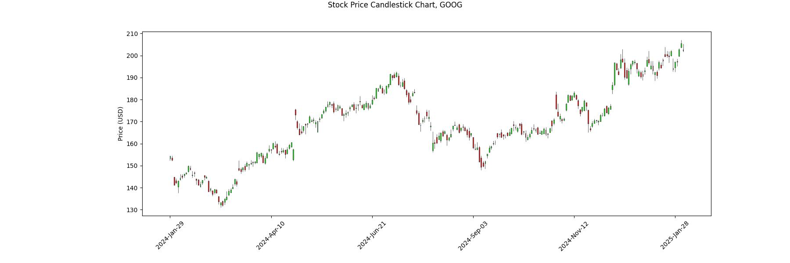

## 3rd example for a run

**Master Agent:**  
Hi, I am finBot, an AI-driven finance agent. I can help you predict whether a stock is likely to go up or down in the next quarter.  
*Please provide me with the name or the ticker symbol of the stock you would like me to analyze.*

---

**User:**  
`Googla`

---
**Master Agent:**  
Sorry, we don't have information on this stock yet. Did you mean to ask about Google ( GOOG )? 
 *Please provide me with the name or the ticker symbol of the stock you would like me to analyze.*

---

**User:**  
`google`

---
**Master Agent:**  
Generating Response according to Google (GOOG) News:

---

**News Agent:**  
_Request for "News Agent":_  
Based on the following five news documents:

**1.** 
Billionaire Bill Ackman Has 43% of His Hedge Fund's $14.8 Billion Portfolio Invested in Just 3 Stocks
Bill Ackman is one of the most closely followed portfolio managers in the world. His most recent effort to bring his portfolio management skills to everyday investors involved acquiring control of Howard Hughes Holdings. Ackman's hedge fund, Pershing Square Capital, already owns about 37% of the company's outstanding shares.
But everyday investors don't have to wait around for a complicated acquisition to go through, if it ever does. They can invest in Ackman's best ideas right now by simply following his public disclosures for Pershing Square. The hedge fund's $14.8 billion portfolio is heavily concentrated in just a handful of companies with three accounting for 43% of its value.
Here are Ackman's favorite investments right now.
1. Uber (15.6%)
Uber Technologies (NYSE: UBER) is the newest addition to Pershing Square's portfolio, and it's a big bet by Ackman. He disclosed a purchase of 30.3 million shares of the ride-sharing company in early February. Those shares are worth approximately $2.3 billion as of this writing.
In his annual shareholder presentation, Ackman pointed to Uber's network effect as the biggest reason he's bullish on the company. Indeed, Uber is the largest ride-sharing network outside of China. It's already leveraged that network of drivers and customers to build Uber Eats and a broader delivery service, which now accounts for half of its volume.
Uber's position as the biggest demand aggregator shields it from the potential disruption of autonomous vehicles (AVs). Uber positioned itself as an essential partner for AV companies looking to build a robotaxi service. Since Uber can aggregate demand and supplement AV supply with human drivers, it can ensure high utilization rates for AV companies. AV companies going it alone will have a majority of their fleet not in use throughout the day.
As such, Ackman sees management's guidance for 30% to 40% annual earnings before interest, taxes, depreciation, and amortization (EBITDA) growth over the next few years as achievable. Management also called for 90%-plus average annual free-cash-flow growth over the next three years at the start of 2024. Free cash flow grew 122% last year.
With such strong growth ahead of it, Uber's forward P/E ratio of around 31 as of this writing looks like a great value.
2. Alphabet (13.8%)
Ackman scooped up a sizable position in Alphabet (NASDAQ: GOOG) (NASDAQ: GOOGL) in early 2023 amid fears that generative artificial intelligence (AI) start-ups would disrupt its Search product. The stock climbed 40% by the time Ackman wrote his midyear update to Pershing Square shareholders in June. Even then, he said the stock still looked attractive. And the price has moved another 48% higher since. Pershing Square's stake in Alphabet is now worth about $2 billion.

**By:** Adam Levy, The Motley Fool, Sun, Mar, Min Read

**Sentiment:** Neutral (Confidence: 0.999998927116394)

**2.** Interested in Quantum Computing Investing? Here Are 4 Fantastic Picks to Maximize Your Odds of Picking a Winner
The quantum computing arms race is starting to heat up, as multiple companies have announced breakthroughs in this important field. However, we're still way out from widespread commercially available quantum computing, so it's difficult to determine which companies are outright winning this race.
Still, that doesn't mean investors need to ignore this important sector. Instead, investors can use a technique known as basket investing to give themselves the best opportunity to make a profit.
Big tech companies have announced huge breakthroughs over the past few months
What is basket investing? Well, it involves filling a basket's worth of different stocks. By not going all-in on one particular company, you spread out this risk among multiple investments. This is similar to creating a mini-index fund or ETF within your portfolio specifically designed to capitalize on one investing trend.
This is a great way to play the quantum computing investing trend, as there are multiple promising companies but no clear leaders yet.
Companies like Alphabet (NASDAQ: GOOG) (NASDAQ: GOOGL) and Microsoft (NASDAQ: MSFT) have recently announced breakthroughs with their various quantum computing chips. In December, Alphabet launched its Willow quantum computing chip, which solved a major problem native to quantum computing: Accuracy.
Quantum computing isn't as precise as traditional computing based on how it transmits information. Traditional computing transmits information in bits, which are either a 0 or a 1. Quantum computing transmits information in qubits, which can be described as a number between 0 and 1. Because there are infinitely more numbers between 0 and 1 (think decimal numbers), qubits can store more information than bits. However, this is inherently inaccurate because it isn't exactly a 0 or a 1.
The company that completely solves this problem first will take a huge lead in the quantum computing race, and companies are getting closer and closer each day.
Google's Willow chip made huge progress toward this goal by arranging the qubits in a grid-like system, making it more accurate as the chip scales in size. Microsoft created a new state of matter to better control the particles and give more accurate answers with its Majorana 1 chip.
However, both of these companies are using their own funding to develop these quantum chips and are working on perfecting them before launching them. While this works with the big tech companies that have massive cash flows to fund these developments, it doesn't work for some of the smaller players.

**By:** Keithen Drury, The Motley Fool, Sat, Mar, Min Read

**Sentiment**: Positive (Confidence: 0.9997257590293884)

**3.** Trump Tariffs Update: Mexico, Canada, China Shots Fired; Here's The Impact As S&P 500 Slides
AI Stocks: Tech Giants, Cloud Titans Face 'Show Me' Moment. Meta To Host AI Conference.
3/03/2025 The good, bad and ugly for AI stocks: Meta and Snowflake shares have both gained 12% in 2025. Google stock...
3/03/2025 The good, bad and ugly for AI stocks: Meta and...

**By:** Jed Graham, Investor'S Business Daily

**Sentiment**: Neutral (Confidence of 0.9999821186065674)

**4.** Trump Tariffs Update: Mexico, Canada, China Shots Fired; Here's The Impact As S&P 500 Slides
AI Stocks: Tech Giants, Cloud Titans Face 'Show Me' Moment. Meta To Host AI Conference.
3/03/2025 The good, bad and ugly for AI stocks: Meta and Snowflake shares have both gained 12% in 2025. Google stock...
3/03/2025 The good, bad and ugly for AI stocks: Meta and...

**By:** Jed Graham, Investor'S Business Daily

**Sentiment**: Neutral (Confidence: 0.9999821186065674)

**5.** Here Are My Top 4 Brilliant AI Stocks to Buy in March
As winter starts to wrap up and we head into March, one thing is clear: Artificial intelligence (AI) investing will still be a major theme in 2025. As a result, investors need to ensure their portfolios are properly positioned to take advantage of this massive investment trend.
I have four stocks that look like top-notch buys in March. They can be divided into two categories: AI facilitators and AI hardware providers.
AI facilitators: Alphabet and Meta Platforms
Alphabet (NASDAQ: GOOG) (NASDAQ: GOOGL) and Meta Platforms (NASDAQ: META) are two key companies facilitating the AI arms race. Both have generative AI models to offer potential users, with Alphabet's Gemini and Meta's Llama models. How these two models are set up and utilized is entirely different, but each has a strong user base.
By facilitating the AI arms race, each is locking in a potential user base, which will pay off over the long term. Because Meta's model is free to use, it does not benefit from a subscription cost. Instead, it's using all the data it gets from being a free-to-use platform to train future models. Gemini is available as a free offering, but a premium subscription unlocks further capabilities. However, Alphabet has also woven its Gemini model into its primary business: Google Search.
AI has a huge effect on both companies, and each is heavily investing in its AI capabilities to ensure that the demand is met. Furthermore, each stock sold off substantially over the past week, as the broad tech market weakness hit both. This opens up a potential investment opportunity, as each is fairly priced, considering their growth levels.
At 26 times forward earnings (Meta) and 19.5 times forward earnings (Alphabet), each stock looks like a very strong buy, considering how much they benefit from the AI trend. I think each is a great buy in March, and investors should use this near-term weakness to their advantage.
AI hardware: Taiwan Semiconductor and ASML
None of these AI innovations would be possible without chip manufacturers and suppliers' equipment, which is why Taiwan Semiconductor (NYSE: TSM) and ASML (NASDAQ: ASML) made this list.
Taiwan Semiconductor is the world's largest contract chip manufacturer, making chips for many of the world's most advanced tech companies. It's seeing a massive boom on its AI chip side, with management expecting around a 45% compounded annual growth rate (CAGR) over the next five years for its AI-related chips. That's a massive growth rate, and it shows the high demand for hardware to power all the AI innovations.

**By:** Keithen Drury, The Motley Fool, Sat, Mar, Min Read

**Sentiment**: Neutral (Confidence: 0.9849352836608887)

*What do you think Google (GOOG) stock performance will be in the next quarter? First, state whether the stock is likely to go up or down in the next quarter. Then, provide a brief explanation supporting your prediction.*

_"News Agent" Response:_

Based on the aggregated information from the news documents, **Google (GOOG) stock is likely to go up in the next quarter**. Here’s why:

1. **Strong AI Momentum:** Google is heavily investing in AI, with its Gemini generative AI model integrated into its core business, such as Google Search. The AI arms race is a significant growth driver, and Google's ability to monetize AI through premium subscriptions and enhanced search capabilities positions it well for future revenue growth.

2. **Quantum Computing Breakthroughs:** Google's progress with its Willow quantum computing chip demonstrates its leadership in cutting-edge technology. This innovation could enhance investor confidence in Google's long-term growth potential.

3. **Valuation and Growth:** At 19.5 times forward earnings, Google's valuation appears attractive relative to its growth prospects. The company's strong performance in 2023, as highlighted by Bill Ackman's investment and subsequent stock price appreciation, indicates continued investor confidence.

4. **Broader Market Sentiment:** Despite recent tech market weakness, Google's diversified business model and leadership in AI and quantum computing make it a resilient player. This could attract investors looking for stability and growth in the tech sector.

Overall, these factors suggest that Google's stock is well-positioned for upward momentum in the next quarter.

---

**Master Agent:**  
Generating Response according to Google (GOOG) Q10 filing:

---

**Q10 Agent:**  
_Request for Q10 Agent:_  
Based on the following sections from the last Q10 filing:

**1.** item 9. changes in and disagreements with accountants on accounting and financial disclosure none. item 9a. controls and procedures
evaluation of disclosure controls and procedures
our management, with the participation of our chief executive officer and chief financial officer, evaluated the
effectiveness of our disclosure controls and procedures pursuant to rule 13a-15 under the exchange act, as of the
end of the period covered by this annual report on form 10-k.
based on this evaluation, our chief executive officer and chief financial officer concluded that, as of december 31,
2024, our disclosure controls and procedures are designed at a reasonable assurance level and are effective to
provide reasonable assurance that information we are required to disclose in reports that we file or submit under the
exchange act is recorded, processed, summarized, and reported within the time periods specified in the sec’s rules
and forms, and that such information is accumulated and communicated to our management, including our chief
executive officer and chief financial officer, as appropriate, to allow timely decisions regarding required disclosure.
changes in internal control over financial reporting
there have been no changes in our internal control over financial reporting that occurred during the quarter
ended december 31, 2024 that have materially affected, or are reasonably likely to materially affect, our internal
control over financial reporting.
management’s report on internal control over financial reporting
our management is responsible for establishing and maintaining adequate internal control over financial
reporting, as defined in rule 13a-15(f) of the exchange act. our management conducted an evaluation of the
effectiveness of our internal control over financial reporting based on the framework in internal control—integrated
framework issued by the committee of sponsoring organizations of the treadway commission (2013 framework).
based on this evaluation, management concluded that our internal control over financial reporting was effective as of
december 31, 2024. management reviewed the results of its assessment with our audit and compliance committee.
the effectiveness of our internal control over financial reporting as of december 31, 2024 has been audited by ernst &
young llp, an independent registered public accounting firm, as stated in its report which is included in item 8 of this
annual report on form 10-k.
limitations on effectiveness of controls and procedures in designing and evaluating the disclosure controls and procedures, management recognizes that any controls and procedures, no matter how well designed and operated, can provide only reasonable assurance of achieving the
desired control objectives. in addition, the design of disclosure controls and procedures must reflect the fact that there
are resource constraints and that management is required to apply its judgment in evaluating the benefits of possible
controls and procedures relative to their costs.
item 9b. other information 10b5-1 trading plans during the quarter ended december 31, 2024, each of the following section 16 director and officer adopted, modified, or terminated a “rule 10b5-1 trading arrangement” (as defined in item 408 of regulation s-k of the
exchange act):
• john hennessy, chair of the board of directors of alphabet, through the john l. hennessy & andrea j.
hennessy revocable trust adopted a trading plan on november 5, 2024 (with the first trade under the plan
scheduled for march 13, 2025). the trading plan will be effective until march 13, 2026 to sell 6,000 shares of
class c capital stock and 1,200 shares of class a common stock.
• sundar pichai, chief executive officer, together with the pichai family foundation, adopted a trading plan on
december 2, 2024 (with the first trade under the plan scheduled for april 2, 2025). the trading plan will be
effective until april 18, 2026 to sell an aggregate of 876,000 shares of class c capital stock.
there were no "non-rule 10b5-1 trading arrangements" (as defined in item 408 of regulation s-k of the
exchange act) adopted, modified, or terminated during the quarter ended december 31, 2024 by our directors and
section 16 officers. each of the rule 10b5-1 trading arrangements are in accordance with our policy against insider
90.
table of contents alphabet inc.
trading and actual sale transactions made pursuant to such trading arrangements will be disclosed publicly in section
16 filings with the sec in accordance with applicable securities laws, rules, and regulations.
compensatory arrangements of certain officers on april 16, 2024, the leadership development, inclusion and compensation committee of the board of directors of alphabet approved the accrual of dividend equivalent units to current and future holders of all unvested
stock units in connection with any regular cash dividend that may be declared by the board of directors of alphabet
from time to time. as stock units are not outstanding shares of stock and thus would not otherwise be entitled to
participate in any dividends, the crediting of dividend equivalent units is intended to preserve the equity-based
incentives intended by the company when the stock units were granted and to treat the holders of unvested stock units
consistently with all stockholders.
required disclosure pursuant to section 13(r) of the exchange act
as previously disclosed, google llc, a subsidiary of alphabet, filed notifications with the russian federal
security service (fsb) pursuant to russian encryption control requirements, which must be complied with prior to the
import of covered items. the information provided pursuant to section 13(r) of the exchange act in part ii, item 5 of
our quarterly report on form 10-q for the quarter ended september 30, 2024 is incorporated herein by reference.
item 9c. disclosure regarding foreign jurisdictions that prevent inspections not applicable.
91. table of contents alphabet inc.
part iii

**2.**  compensation expenses $ 16,132 $ 19,054 $ 20,519 Other costs and expenses 12,070 12,318 16,598
Total Google Cloud costs and expenses $ 28,202 $ 31,372 $ 37,117
Google Services and Google Cloud employee compensation expenses include the costs associated with direct
and allocated employees. Google Services and Google Cloud other costs and expenses primarily include direct costs,
such as advertising and promotional activities and third party services fees as well as allocated costs, such as
technical infrastructure and office facilities usage costs. Additionally, Google Services other costs and expenses
include content and traffic acquisition costs and device costs.
See Note 2 for information relating to revenues by geography.
88.
Table of Contents Alphabet Inc.
The following table presents long-lived assets by geographic area, which includes property and equipment, net
and operating lease assets (in millions):
As of December 31,
2023 2024
Long-lived assets:
United States $ 110,053 $ 138,993
International 38,383 45,631
Total long-lived assets $ 148,436 $ 184,624
Note 16. Subsequent Event In January 2025, we recognized an $8.0 billion unrealized gain on our non-marketable equity securities related to
our investment in a private company. The unrealized gain reflects an increase in the fair value measurement of our
investment following an observable transaction in January 2025. See Note 3 and Note 7 for further details on equity
investments and OI&E.
89.
Table of Contents Alphabet Inc.
ITEM 9. CHANGES IN AND DISAGREEMENTS WITH ACCOUNTANTS ON ACCOUNTING AND FINANCIAL
DISCLOSURE
None.
ITEM 9A. CONTROLS AND PROCEDURES
Evaluation of Disclosure Controls and Procedures
Our management, with the participation of our chief executive officer and chief financial officer, evaluated the
effectiveness of our disclosure controls and procedures pursuant to Rule 13a-15 under the Exchange Act, as of the
end of the period covered by this Annual Report on Form 10-K.
Based on this evaluation, our chief executive officer and chief financial officer concluded that, as of December 31,
2024, our disclosure controls and procedures are designed at a reasonable assurance level and are effective to
provide reasonable assurance that information we are required to disclose in reports that we file or submit under the
Exchange Act is recorded, processed, summarized, and reported within the time periods specified in the SEC’s rules
and forms, and that such information is accumulated and communicated to our management, including our chief
executive officer and chief financial officer, as appropriate, to allow timely decisions regarding required disclosure.
Changes in Internal Control over Financial Reporting
There have been no changes in our internal control over financial reporting that occurred during the quarter
ended December 31, 2024 that have materially affected, or are reasonably likely to materially affect, our internal
control over financial reporting.
Management’s Report on Internal Control over Financial Reporting
Our management is responsible for establishing and maintaining adequate internal control over financial
reporting, as defined in Rule 13a-15(f) of the Exchange Act. Our management conducted an evaluation of the
effectiveness of our internal control over financial reporting based on the framework in Internal Control—Integrated
Framework issued by the Committee of Sponsoring Organizations of the Treadway Commission (2013 framework).
Based on this evaluation, management concluded that our internal control over financial reporting was effective as of
December 31, 2024. Management reviewed the results of its assessment with our Audit and Compliance Committee.
The effectiveness of our internal control over financial reporting as of December 31, 2024 has been audited by Ernst &
Young LLP, an independent registered public accounting firm, as stated in its report which is included in Item 8 of this
Annual Report on Form 10-K.
Limitations on Effectiveness of Controls and Procedures
In designing and evaluating the disclosure controls and procedures, management recognizes that any controls
and procedures, no matter how well designed and operated, can provide only reasonable assurance of achieving the
desired control objectives. In addition, the design of disclosure controls and procedures must reflect the fact that there
are resource constraints and that management is required to apply its judgment in evaluating the benefits of possible
controls and procedures relative to their costs.
ITEM 9B. OTHER INFORMATION
10b5-1 Trading Plans
During the quarter ended December 31, 2024, each of the following Section 16 director and officer adopted,
modified, or terminated a “Rule 10b5-1 trading arrangement” (as defined in Item 408 of Regulation S-K of the
Exchange Act):
• John Hennessy, Chair of the Board of Directors of Alphabet, through the John L. Hennessy & Andrea J.
Hennessy Revocable Trust adopted a trading plan on November 5, 2024 (with the first trade under the plan
scheduled for March 13, 2025). The trading plan will be effective until March 13, 2026 to sell 6,000 shares of
Class C Capital Stock and 1,200 shares of Class A Common Stock.
• Sundar Pichai, Chief Executive Officer, together with the Pichai Family Foundation, adopted a trading plan on
December 2, 2024 (with the first trade under the plan scheduled for April 2, 2025). The trading plan will be
effective until April 18, 2026 to sell an aggregate of 876,000 shares of Class C Capital Stock.
There were no "non-Rule 10b5-1 trading arrangements" (as defined in Item 408 of Regulation S-K of the
Exchange Act) adopted, modified, or terminated during the quarter ended December 31, 2024 by our directors and
Section 16 officers. Each of the Rule 10b5-1 trading arrangements are in accordance with our Policy Against Insider
90.
Table of Contents Alphabet Inc.
Trading and actual sale transactions made pursuant to such trading arrangements will be disclosed publicly in Section
16 filings with the SEC in accordance with applicable securities laws, rules, and regulations.
Compensatory Arrangements of Certain Officers
On April 16, 2024, the Leadership Development, Inclusion and Compensation Committee of the Board of
Directors of Alphabet approved the accrual of dividend equivalent units to current and future holders of all unvested
stock units in connection with any regular cash dividend that may be declared by the Board of Directors of Alphabet
from time to time. As stock units are not outstanding shares of stock and thus would not otherwise be entitled to
participate in any dividends, the crediting of dividend equivalent units is intended to preserve the equity-based
incentives intended by the company when the stock units were granted and to treat the holders of unvested stock units
consistently with all stockholders.
Required Disclosure Pursuant to Section 13(r) of the Exchange Act
As previously disclosed, Google LLC, a subsidiary of Alphabet, filed notifications with the Russian Federal
Security Service (FSB) pursuant to Russian encryption control requirements, which must be complied with prior to the import

**3.**  future environmental impact of ai,
which is complex and difficult to predict. in addition, solutions for some key global challenges do not currently exist,
and will depend heavily on the development and improvement of new technologies by us and by the energy sector. as
our business and industry continue to evolve, we expect our total ghg emissions to rise before dropping toward our
absolute emissions reduction target.
for additional information about risks and uncertainties applicable to our work on sustainability and efficiency, see
item 1a risk factors of this annual report on form 10-k.
culture and workforce
we are a company of curious, talented, and passionate people. we embrace collaboration and creativity, and
encourage the iteration of ideas to address complex challenges in technology and society.
our people are critical for our continued success, so we work hard to create an environment where employees
can have fulfilling careers, and be happy, healthy, and perform at a high level. we offer industry-leading benefits and
programs to take care of the diverse needs of our employees and their families, including opportunities for career
growth and development, resources to support their financial health, and access to excellent healthcare choices. our
competitive compensation programs help us to attract and retain key talent, and we will continue to invest in recruiting
talented people to technical and non-technical roles, and rewarding them well. we provide a variety of high quality
training and support to managers to build and strengthen their capabilities-–ranging from courses for new managers, to
learning resources that help them provide feedback and manage performance, to coaching and individual support.
as of december 31, 2024, alphabet had 183,323 employees. we have work councils and statutory employee
representation obligations in certain countries, and we are committed to supporting protected labor rights, maintaining
an open culture, and listening to all employees. supporting healthy and open dialogue is central to how we work, and
we communicate information about the company through multiple internal channels to our employees.
when appropriate we partner with outside companies on a contractual basis to provide a specialized service or to
temporarily cover a short-term need. the employees of our suppliers and staffing partners — vendors and temporary
staff, respectively — and independent contractors who are self-employed, make up our extended workforce. we
choose our partners and staffing agencies carefully, and review their compliance with google’s supplier code of
conduct.
government regulation
we are subject to numerous united states (u.s.) federal, state, and local, as well as foreign laws and regulations
covering a wide variety of subjects, and the scope of this coverage continues to broaden with continuing new legal and
regulatory developments in the u.s. and internationally. like other companies in the technology industry, we face
increasingly heightened scrutiny from both u.s. and foreign governments with respect to our compliance with laws and
9.
table of contents alphabet inc.
regulations. many of these laws and regulations are evolving and their applicability and scope, as interpreted by the
courts, remain uncertain. particularly with regard to ai; competition; consumer protection; content moderation; data
privacy and security; news publications; and sustainability and other social matters, we have seen an increase in new
and evolving laws and regulations, as well as related enforcement actions and investigations, being proposed and
implemented in recent years by legislative and regulatory bodies around the world. as we have seen in recent years,
different laws and regulations on the same topic may not always have the same requirements, and even when
requirements overlap, the rules are not always consistently implemented, interpreted, and enforced from jurisdiction to
jurisdiction.
our compliance with these laws and regulations may be onerous and could, individually or in the aggregate,
increase our cost of doing business, make our products and services less useful, limit our ability to pursue certain
business practices or offer certain products and services, cause us to change our business models and operations,
affect our competitive position relative to our peers, and/or otherwise harm our business, reputation, financial condition,
and operating results.
for additional information about government regulation applicable to our business, see item 1a risk factors;
trends in our business and financial effect in part ii, item 7; and legal matters in note 10 of the notes to
consolidated financial statements included in part ii, item 8 of this annual report on form 10-k.
intellectual property
we rely on various intellectual property laws, confidentiality procedures and contractual provisions to protect our
proprietary technology and our brand. we have registered, and applied for the registration of, u.s. and international
trademarks, service marks, domain names, and copyrights. we have also filed patent applications in the u.s. and
foreign countries covering certain of our technology, and acquired patent assets to supplement our portfolio. we have
licensed in the past, and expect that we may license in the future, certain of our rights to other parties. for additional
information, see item 1a risk factors of this annual report on form 10-k.
available information
our website is located at www.abc.xyz, and our investor relations website is located at www.abc.xyz/investor.
access to our annual reports on form 10-k, quarterly reports on form 10-q, current reports on form 8-k, and our
proxy statements, and any amendments to these reports, is available on our investor relations website, free of charge,
after we file or furnish them with the sec and they are available on the sec's website at www.sec.gov.
we webcast via our investor relations youtube channel and website our earnings calls and certain events we
participate in or host with members of the investment community. our investor relations website also provides
notifications of news or announcements regarding our financial performance and other items that may be material or of
interest to our investors, including sec filings, investor events, press and earnings releases, and blogs. we also share
google news and product updates on google's keyword blog at https://www.blog.google/ and news from google
page on x at x.com/newsfromgoogle, and our executive officers may also use certain social media channels, such as
x and linkedin, to communicate information about earnings results and company updates, which may be of interest or
material to our investors. further, corporate governance information, including our certificate of incorporation, bylaws,
governance guidelines, board committee charters, and code of conduct, is also available on our investor relations
website under the heading "governance." the information contained on, or that may be accessed through our
websites or our executive officers' social media channels, is not incorporated by reference into this annual report on
form 10-k or in any other report or document we file with the sec, and any references to our websites are intended to
be inactive textual references only.
item 1a. risk factors
our operations and financial results are subject to various risks and uncertainties, including but not limited to
those described below, which could harm our business, reputation, financial condition, and operating results, and affect
the trading price of our class a and class c stock.
risks specific to our company
we generate a significant portion of our revenues from advertising. reduced spending by advertisers, a
loss of partners, or new and existing technologies that

*What do you think Google (GOOG) stock performance will be in the next quarter? First, state whether the stock is likely to go up or down in the next quarter. Then, provide a brief explanation supporting your prediction.*

_Q10 Agent Response:_

Based on the information provided, **Google (GOOG) stock is likely to go up in the next quarter**. Here’s the reasoning:

1. **Strong Internal Controls and Financial Reporting**
   - The company’s management and auditors have confirmed the effectiveness of its internal controls over financial reporting, with no material weaknesses or changes. This reflects operational stability and transparency, which are positive signals for investors.

2. **Growth in Long-Lived Assets**
   - Alphabet’s long-lived assets increased significantly from $148.4 billion in 2023 to $184.6 billion in 2024, driven by investments in infrastructure and operations. This suggests continued expansion, particularly in high-growth areas like Google Cloud and AI.

3. **Google Cloud Growth**
   - Google Cloud’s costs and expenses have risen, indicating increased investment in this segment. While this may pressure margins in the short term, it reflects Alphabet’s commitment to capturing market share in the rapidly growing cloud computing industry, which is a long-term growth driver.

4. **Unrealized Gain on Equity Investments**
   - Alphabet recognized an $8 billion unrealized gain on non-marketable equity securities in January 2025. This gain could positively impact the company’s financial results in the next quarter, boosting investor sentiment.

5. **Commitment to Sustainability and Workforce**
   - Alphabet’s focus on sustainability and its competitive employee benefits and compensation programs help attract and retain top talent. This positions the company well for innovation and long-term growth, particularly in areas like AI and cloud computing.

6. **10b5-1 Trading Plans**
   - While insider trading plans by executives like Sundar Pichai and John Hennessy may raise questions, these are pre-scheduled sales under Rule 10b5-1 and do not necessarily indicate negative sentiment. The market typically views such sales as neutral if the company’s fundamentals remain strong.

7. **Regulatory Risks and AI Investments**
   - While Alphabet faces regulatory scrutiny and challenges related to AI, the company’s proactive investments in AI and its leadership in the space position it to capitalize on future opportunities. However, these risks should be monitored closely.

8. **Macroeconomic Environment**
   - If macroeconomic conditions remain stable or improve, advertising spending (a key revenue driver for Alphabet) is likely to recover or grow, further supporting the stock.

**Conclusion**:
While there are risks related to regulatory scrutiny and rising costs, Alphabet’s strong financial position, growth in strategic areas like Google Cloud, and unrealized gains on investments suggest positive momentum. Therefore, the stock is likely to perform well in the next quarter, barring any significant macroeconomic or regulatory shocks.

---
**Master Agent:**  
Generating Response according to Google (GOOG) Reported Financial Numbers:

---

**Reported Financial Numbers Agent:**

_Request for Reported Financial Numbers Agent:_  

The following table contains numerical statistics on the last five quarterly earnings reports of Google (GOOG). It includes the earnings per share (EPS) estimate, the reported EPS, and the earnings surprise percentage for each quarter.

| Date       | EPS Estimate | Reported EPS | Surprise (%) |
|------------|--------------|--------------|--------------|
| 2025-02-03 | 2.13         | 2.15         | 1.13         |
| 2024-10-28 | 1.85         | 2.12         | 14.63         |
| 2024-07-22 | 1.84         | 1.89         | 2.46         |
| 2024-04-24 | 1.51         | 1.89         | 25.21        |
| 2024-01-29 | 1.59         | 1.64         | 2.93        |

Additionally, here is a table which compares the financial performance of the company according to the last five earning reports (including the last):

**Company Earnings Data:**

|                     |   Tax Effect Of Unusual Items |   Tax Rate For Calcs |   Normalized EBITDA |   Total Unusual Items |   Total Unusual Items Excluding Goodwill |   Net Income From Continuing Operation Net Minority Interest |   Reconciled Depreciation |   Reconciled Cost Of Revenue |     EBITDA |       EBIT |   Net Interest Income |   Interest Expense |   Interest Income |   Normalized Income |   Net Income From Continuing And Discontinued Operation |   Total Expenses |   Total Operating Income As Reported | Diluted Average Shares   | Basic Average Shares   | Diluted EPS   | Basic EPS   |   Diluted NI Availto Com Stockholders | Average Dilution Earnings   |   Net Income Common Stockholders |   Net Income |   Net Income Including Noncontrolling Interests |   Net Income Continuous Operations |   Tax Provision |   Pretax Income |   Other Income Expense |   Other Non Operating Income Expenses |   Earnings From Equity Interest |   Gain On Sale Of Security |   Net Non Operating Interest Income Expense |   Interest Expense Non Operating |   Interest Income Non Operating |   Operating Income |   Operating Expense |   Research And Development |   Selling General And Administration |   Selling And Marketing Expense |   General And Administrative Expense |   Other Gand A |   Gross Profit |   Cost Of Revenue |   Total Revenue |   Operating Revenue |
|:--------------------|------------------------------:|---------------------:|--------------------:|----------------------:|-----------------------------------------:|-------------------------------------------------------------:|--------------------------:|-----------------------------:|-----------:|-----------:|----------------------:|-------------------:|------------------:|--------------------:|--------------------------------------------------------:|-----------------:|-------------------------------------:|:-------------------------|:-----------------------|:--------------|:------------|--------------------------------------:|:----------------------------|---------------------------------:|-------------:|------------------------------------------------:|-----------------------------------:|----------------:|----------------:|-----------------------:|--------------------------------------:|--------------------------------:|---------------------------:|--------------------------------------------:|---------------------------------:|--------------------------------:|-------------------:|--------------------:|---------------------------:|-------------------------------------:|--------------------------------:|-------------------------------------:|---------------:|---------------:|------------------:|----------------:|--------------------:|
| 2024-12-31 00:00:00 |                  -1.5576e+07  |             0.177    |          3.6589e+10 |            -8.8e+07   |                               -8.8e+07   |                                                   2.6536e+10 |                 4.205e+09 |                   4.0613e+10 | 3.6501e+10 | 3.2296e+10 |             1.035e+09 |            5.3e+07 |         1.088e+09 |         2.66084e+10 |                                              2.6536e+10 |       6.5497e+10 |                           3.0972e+10 | N/A                      | N/A                    | N/A           | N/A         |                            2.6536e+10 | N/A                         |                       2.6536e+10 |   2.6536e+10 |                                      2.6536e+10 |                         2.6536e+10 |       5.707e+09 |      3.2243e+10 |              2.36e+08  |                              4.11e+08 |                       -8.7e+07  |                 -8.8e+07   |                                   1.035e+09 |                          5.3e+07 |                       1.088e+09 |         3.0972e+10 |          2.4884e+10 |                 1.3116e+10 |                           1.1768e+10 |                       7.363e+09 |                            4.405e+09 |      4.405e+09 |     5.5856e+10 |        4.0613e+10 |      9.6469e+10 |          9.6469e+10 |
| 2024-09-30 00:00:00 |                   3.4068e+08  |             0.17     |          3.3741e+10 |             2.004e+09 |                                2.004e+09 |                                                   2.6301e+10 |                 3.985e+09 |                   3.6474e+10 | 3.5745e+10 | 3.176e+10  |             1.189e+09 |            5.4e+07 |         1.243e+09 |         2.46377e+10 |                                              2.6301e+10 |       5.9747e+10 |                           2.8521e+10 | 12419000000.0            | 12290000000.0          | 2.12          | 2.14        |                            2.6301e+10 | N/A                         |                       2.6301e+10 |   2.6301e+10 |                                      2.6301e+10 |                         2.6301e+10 |       5.405e+09 |      3.1706e+10 |              1.996e+09 |                              9.9e+07  |                       -1.07e+08 |                  2.004e+09 |                                   1.189e+09 |                          5.4e+07 |                       1.243e+09 |         2.8521e+10 |          2.3273e+10 |                 1.2447e+10 |                           1.0826e+10 |                       7.227e+09 |                            3.599e+09 |      3.599e+09 |     5.1794e+10 |        3.6474e+10 |      8.8268e+10 |          8.8268e+10 |
| 2024-06-30 00:00:00 |                  -1.71171e+08 |             0.143    |          3.2523e+10 |            -1.197e+09 |                               -1.197e+09 |                                                   2.3619e+10 |                 3.708e+09 |                   3.5507e+10 | 3.1326e+10 | 2.7618e+10 |             1.023e+09 |            6.7e+07 |         1.09e+09  |         2.46448e+10 |                                              2.3619e+10 |       5.7317e+10 |                           2.7425e+10 | 12495000000.0            | 12343000000.0          | 1.89          | 1.91        |                            2.3619e+10 | N/A                         |                       2.3619e+10 |   2.3619e+10 |                                      2.3619e+10 |                         2.3619e+10 |       3.932e+09 |      2.7551e+10 |             -8.97e+08  |                              2.68e+08 |                        3.2e+07  |                 -1.197e+09 |                                   1.023e+09 |                          6.7e+07 |                       1.09e+09  |         2.7425e+10 |          2.181e+10  |                 1.186e+10  |                           9.95e+09   |                       6.792e+09 |                            3.158e+09 |      3.158e+09 |     4.9235e+10 |        3.5507e+10 |      8.4742e+10 |          8.4742e+10 |
| 2024-03-31 00:00:00 |                   2.53052e+08 |             0.164    |          3.0279e+10 |             1.543e+09 |                                1.543e+09 |                                                   2.3662e+10 |                 3.413e+09 |                   3.3712e+10 | 3.1822e+10 | 2.8409e+10 |             9.67e+08  |            9.4e+07 |         1.061e+09 |         2.23721e+10 |                                              2.3662e+10 |       5.5067e+10 |                           2.5472e+10 | 13396000000.0            | 12415000000.0          | 1.89          | 1.91        |                            2.5303e+10 | 1641000000.0                |                       2.3662e+10 |   2.3662e+10 |                                      2.3662e+10 |                         2.3662e+10 |       4.653e+09 |      2.8315e+10 |              1.876e+09 |                              3.59e+08 |                       -2.6e+07  |                  1.543e+09 |                                   9.67e+08  |                          9.4e+07 |                       1.061e+09 |         2.5472e+10 |          2.1355e+10 |                 1.1903e+10 |                           9.452e+09  |                       6.426e+09 |                            3.026e+09 |      3.026e+09 |     4.6827e+10 |        3.3712e+10 |      8.0539e+10 |          8.0539e+10 |
| 2023-12-31 00:00:00 |                   3.35696e+06 |             0.152589 |          2.6022e+10 |             2.2e+07   |                                2.2e+07   |                                                   2.0687e+10 |                 1.563e+09 |                   3.7575e+10 | 2.6044e+10 | 2.4481e+10 |             1.041e+09 |            6.9e+07 |         1.11e+09  |         2.06684e+10 |                                              2.0687e+10 |       6.2613e+10 |                           2.3697e+10 | 12602000000.0            | 12488000000.0          | 1.64          | 1.66        |                            2.0687e+10 | N/A                         |                       2.0687e+10 |   2.0687e+10 |                                      2.0687e+10 |                         2.0687e+10 |       3.725e+09 |      2.4412e+10 |             -3.26e+08  |                             -9.2e+07  |                       -2.56e+08 |                  2.2e+07   |                                   1.041e+09 |                          6.9e+07 |                       1.11e+09  |         2.3697e+10 |          2.5038e+10 |                 1.2113e+10 |                           1.2925e+10 |                       7.719e+09 |                            5.206e+09 |      5.206e+09 |     4.8735e+10 |        3.7575e+10 |      8.631e+10  |          8.631e+10  |

*Based on this financial data, what do you think Google (GOOG) stock performance will be in the next quarter? First, state whether the stock is likely to go up or down in the next quarter. Then, provide a brief explanation supporting your prediction.*

_Reported Financial Numbers Agent Response:_

Based on the provided data, **Google (GOOG) stock is likely to go up in the next quarter**. Here's the reasoning:

1. **Consistent Earnings Outperformance**: Over the last five quarters, Google has consistently beaten its EPS estimates, with earnings surprises ranging from 1.13% to 25.21%. This trend of exceeding expectations suggests strong operational performance and effective cost management, which typically boosts investor confidence.

2. **Strong Revenue Growth**: The financial data shows consistent growth in total revenue, with the most recent quarter reporting $96.469 billion in operating revenue, up from $86.31 billion five quarters ago. This indicates robust demand for Google's products and services, particularly in its core advertising and cloud businesses.

3. **Improving Profitability Metrics**: Google's normalized EBITDA and operating income have shown steady growth, reflecting improved profitability. For example, normalized EBITDA in the most recent quarter was $36.589 billion, up from $26.022 billion five quarters ago. This suggests that the company is effectively scaling its operations while maintaining cost efficiency.

4. **Market Sentiment and Momentum**: The stock market often rewards companies that consistently outperform expectations. Google's ability to deliver positive earnings surprises and maintain strong financial performance is likely to sustain positive sentiment among investors.

5. **Macroeconomic Resilience**: Despite potential macroeconomic challenges, Google's diversified revenue streams (e.g., advertising, cloud computing, and hardware) and strong cash flow position it well to weather economic uncertainties. This resilience further supports the likelihood of continued stock price appreciation.

### Caveat:
While the outlook is positive, external factors such as macroeconomic conditions, regulatory scrutiny, or unexpected market disruptions could impact the stock's performance. Investors should monitor these risks closely.

---

**Master Agent:**  
Generating Response according to Google (GOOG) Stock Price Chart:

---

**Stock Price Agent:**

_Stock Price Agent Request:_

*Based on the following candlestick chart of the stock's prices, What do you think Google (GOOG) stock performance will be in the next quarter? First, state whether the stock is likely to go up or down in the next quarter. Then, provide a brief explanation supporting your prediction.*

**Image:**  

_Stock Price Agent Response:_ 

Based on the candlestick chart provided, **Google (GOOG) stock is likely to go up in the next quarter**.

**Explanation:**
1. **Uptrend Continuation:**  
The chart shows a clear upward trend over the past year, with higher highs and higher lows. This suggests strong bullish momentum.

2. **Recent Breakout:**  
Toward the end of the chart, the stock appears to be breaking out to new highs, which is often a bullish signal indicating continued upward movement.

3. **Consolidation and Recovery:**  
Periods of consolidation (sideways movement) followed by recoveries and upward moves suggest that the stock is building support levels before moving higher.

4. **Market Sentiment**: The consistent upward movement indicates positive market sentiment and investor confidence in the stock.\n\nWhile technical analysis suggests a bullish outlook, it is important to consider external factors such as earnings reports, macroeconomic conditions, and industry trends that could influence the stock's performance."

_Note:_ 
This prediction is based solely on technical analysis of the chart. Fundamental factors—such as earnings reports, subscriber growth, and broader macroeconomic conditions—could significantly impact the stock's future performance.

---

**Master Agent (Final Statement):**  
Based on the information provided, the stock of Google (GOOG) is likely to go up in the next quarter.
